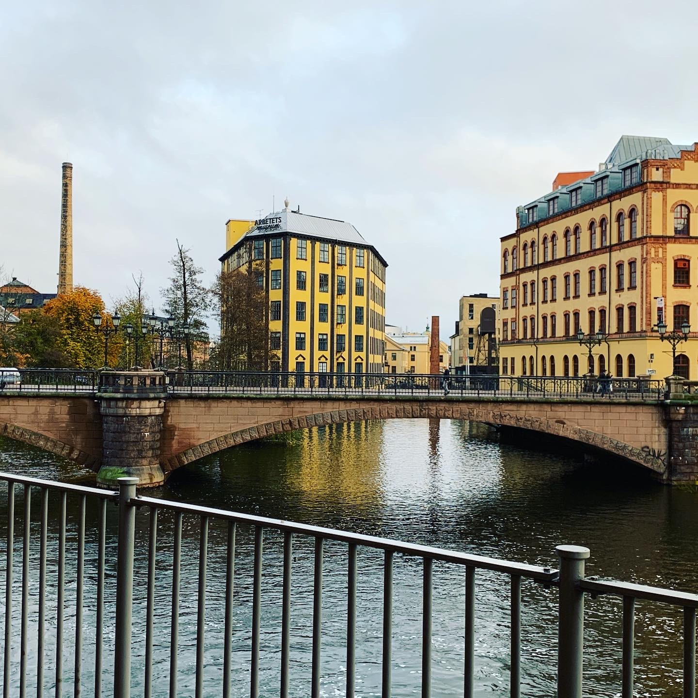
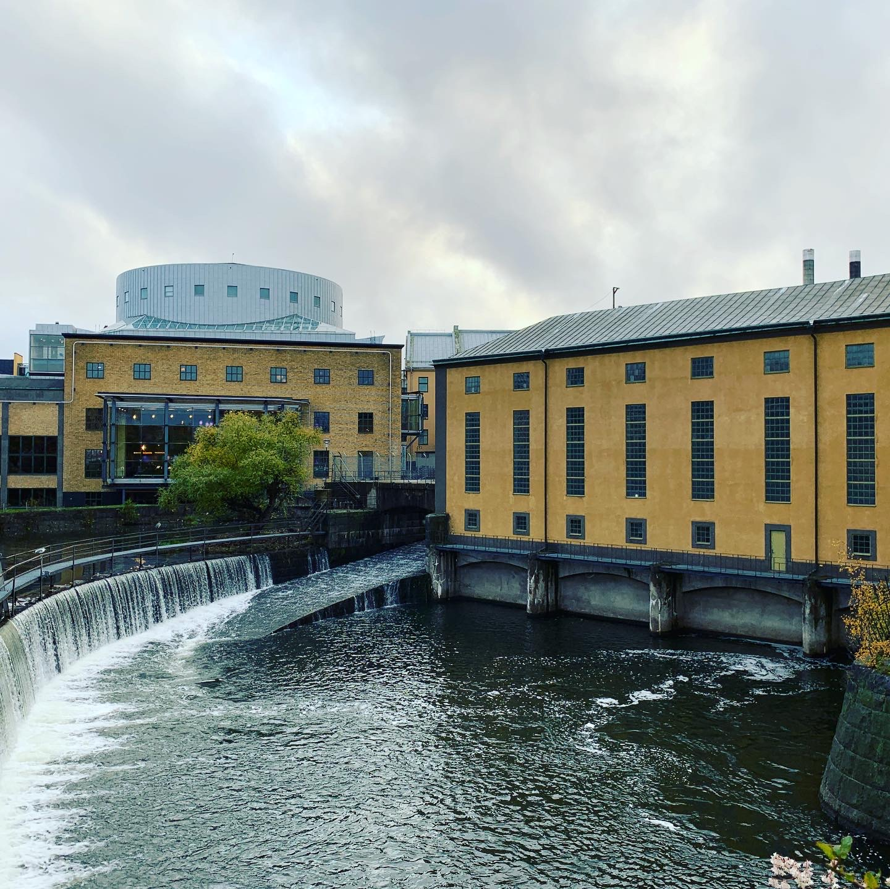
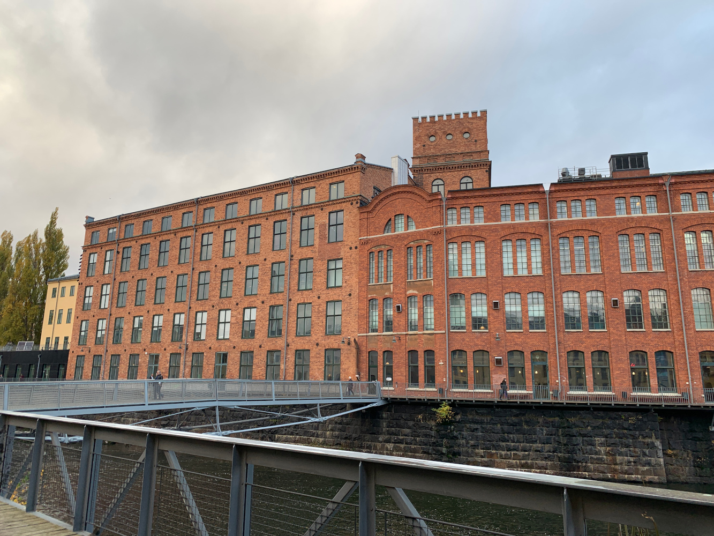

It’s Friday again, and this means it’s time for the second blog post. I’ve been in Norrköping for a week now, and during that time a lot has happened. There was the U.S. Election 2020 on Tuesday, all the while most countries – at least in Europe – finally went into another lockdown due to Corona. And in the meantime, I’ve learned to love the slightly worn-off wallpaper in my apartment’s kitchen.

When I arrived on Friday, and left the plane, I got the notification that Sweden had just entered a “lockdown light.” Awesome timing, I know, but personally I prefer learning to love my apartment’s walls rather than the inside of a Swedish hospital. So I went to my apartment and stayed there since. I think I have mentioned this elsewhere, but to reiterate: Being a researcher is one of the few occupations where you are not affected very much by Corona. You can work as if there was no global pandemic: you have all the resources you need on your computer (or, rather, on the internet), and there’s most certainly no shortage of work.

This has definitely helped to survive quarantine, as I can still participate in everything work-related, and do not have the feeling of being left out by staying at home. I had the first university meetings and also received the first batch of work from my supervisor.

Fortunately, I am not fully restricted to my apartment as I would be in Germany (which would’ve amounted to a serious problem with regard to buying groceries), so I used the chance to go out and see the city. This was perfectly fine, as the sidewalks are large and allow to stay apart from anyone else. So let me share my first impressions!

First of all, Sweden is a different country, so cultural differences are to be expected. Nevertheless, the comparison with Germany highlights some interesting facts about both countries. One of the first things I noticed was the way Swedes lock their doors. While the concept of keys is pretty much universal, there are different approaches to locking doors which I haven’t thought of before. Many Swedish houses feature a keypad at the front door which allows you to enter using a four-digit code rather than a key, which is a clever idea when you think about mailmen.

This also seems to have influenced the placement of doorbells: I have yet to see a house where the doorbells are at the front door, and not only at the flat entrance. Speaking of which: While in Germany almost all entrance doors have fixed doorknobs (so you have to use your key every time you want to open it), those doors have normal handles in Sweden. Which means: If you don’t lock the door from the inside, anyone can just open it and come in. Apparently, Swedish homes are less like castles and more like … well, homes. Or even more like castles, if you constantly lock your door from the inside. I’ll let you decide that.

A second difference between Sweden and Germany which I noticed is related to groceries: most supermarkets are opened almost non-stop – even on Sundays it’s normal to be able to go shopping. It does feel a bit weird, because I was always of the opinion that Sundays are somehow “lost days” because nothing has open. Yet, now that so much _is_ actually open on Sundays, it does feel strange. Maybe I’m just more German than I realised until now.

Besides that, the city itself is extremely beautiful. There are lots of historic buildings, and the Linköping University campus here in Norrköping is especially stunning. The campus is located in old industrial buildings which very much remind of the height of industrialisation at the end of the 19th century. As industrial buildings, they have been built along the local river (_Motala_), so we even get to enjoy a nice view. All in all, I really like the city, and once the whole pandemic is over, I am sure that I will be enjoying it even more.

Now the next steps are to get working on my PhD, and for that I have reworked my reading workflow. So in one of the next posts, I will most certainly outline how I now read papers. There’s still some fine tuning left to do, but all in all, I am very happy with how it’s working out right now. So stay tuned!
