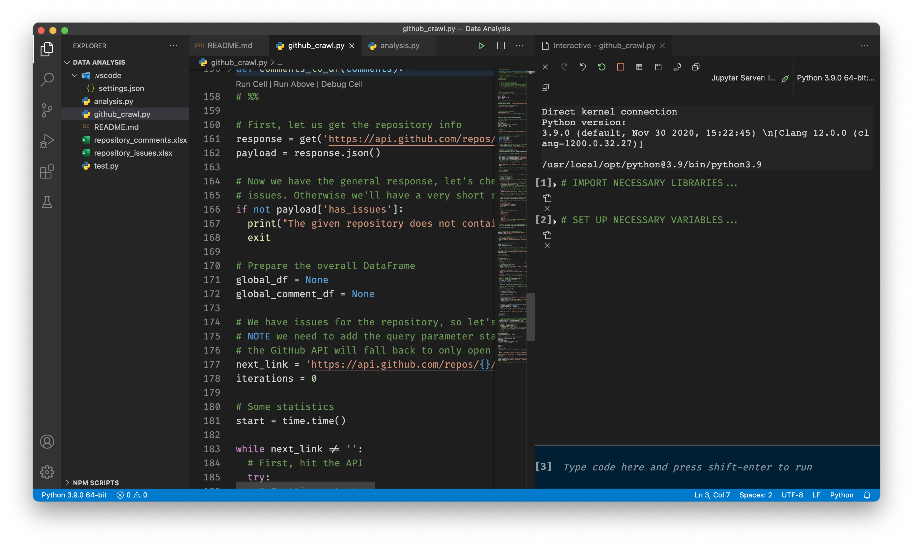

The second month of my PhD here at IAS has begun, and while I’m still reading a lot in preparation for the core work of my PhD, another thing I have to tend to is getting back into data analysis.

As Analytical Sociology is more and more merging with Computational Social Sciences, and increasingly uses machine learning technologies in order to cope with the large amounts of data that have become known as “big data,” a main area of my expertise will concern data analysis.

Those of you who know me a little bit better will know that I’ve always been fascinated by analysing piles of data. However, my actual practical knowledge of that area is pretty sparse. During my undergrad studies I was a student assistant at a project located at the Zentrum für Entwicklungsforschung (ZEF), University of Bonn. There, I really learned the guts of [Stata](https://www.stata.com/) while analysing roughly 1.5 GB of data on the food-energy-security nexus in rural Ethiopia.

After I finished the project, my Stata code has grown to over 1,000 lines of code; I’ve divided the analytical work into dozens of smaller batches and implemented a form of caching. Back then I did not think of it as caching, but indeed, I wrote the analytical results to temporary `*.dta`-files after each cycle of analysis, so that subsequent scripts could use those data, saving a lot of computing power (my work PC was not that awesome back then). So when I changed something in part two of the analysis, I didn’t need to re-run part one, as nothing has changed, and I could just continue with the last temporary file from part one.

Fast-forward four years: I’m now at the IAS, and not only have I ditched Stata, I also have a lot more analysis to do. Stata is a very nice statistical tool when it comes to the everyday analytical computations that have dominated sociology for five decades now: regression, data cleaning, PCA (Principal Component Analysis), or MCA (Multiple Correspondence Analysis).

Unlike IBM’s [SPSS](https://www.ibm.com/analytics/spss-statistics-software), whose own scripting language looks as if Alan Turing has invented it in the last century, Stata is fast, lean, and, for someone who knows how to write programs, its internal scripting language (written to `.do`-files) is much more comfortable to work with – and more powerful.

However, I decided not to use Stata ever again. There are two reasons for this. First, Stata has been made with traditional social science in mind, and it lacks support for certain machine learning techniques. Besides, I guess that at a certain threshold the data would just be too much for it to handle. But second, and more importantly, Stata is not Open Source. When there are Open Source alternatives that work as good as, or better than, my current choice, it’s time for a replacement.

## Python for Data Analysis

I think I might not tell you anything new if I now reveal that said alternative is Python. While I’m still vocal about the missing curly brackets in the language and some other oddities, there’s no denying the fact that Python is one of the best languages you could possibly use to perform big data analysis. It’s fast, it can be compiled to machine code, and it has support of the big players in machine learning — TensorFlow and PyTorch are the two leading neural network frameworks, implemented in Python.

So the choice was just natural. However, I wouldn’t dedicate a whole blog post to it, if there wasn’t some off-road customisation in my own setup!

While Python is just a multi-purpose programming language, it has a dedicated community of data analysts who build specialised tool-chains to work with Python in a much more efficient way than if you’d use plain Python. So while the common programmer not dedicated to data science would use internal data structures and use the standard command-line interpreter running scripts with `python3 ./script.py`, data science with Python works differently.

First, there are a lot of libraries dedicated to facilitating the process of dealing with data structures. For instance, while programmers can build their own data structures using dictionaries (= hash maps), lists (= arrays) and primitive types (numbers, booleans, strings), a data scientist needs exactly one data type: A table containing all observations as rows and variables as columns. Furthermore, they need matrices, vectors, and support for pretty heavy computations. Most of these requirements are met by the two libraries `numpy` (to crunch numbers) and `pandas` (to handle tabular data; `pandas` depends upon `numpy`).

## Introducing Jupyter

Secondly, and possibly more importantly, there are certain tools that make data analysis with Python extremely easy. One of the most common are Jupyter notebooks. Jupyter is – again – a module for Python that facilitates support for Markdown-enhanced data analysis. This means that Jupyter notebook files (`.ipynb`) contain both code that can be run and descriptions/notes using Markdown formatting. An example is [this tutorial to word vectors](https://gist.github.com/aparrish/2f562e3737544cf29aaf1af30362f469). As you can see, text alternates with so-called “cells” that contain executable code. This way you can actually explain your data analysis.

To create Jupyter notebooks, a common approach is to install a package called [Anaconda](https://www.anaconda.com/products/individual). It’s basically a one-shot solution at data analysis. Just install it, and you’re ready to go. However, as with the “big” LaTeX distributions, the Anaconda package is actually extremely spacious. There’s a lot of neat stuff in there, but, honestly? You won’t need most of it. So I tend to favour lean installs. How I did it? With [Visual Studio Code](https://code.visualstudio.com/)!

## Introducing VS Code

While I’m not fond of Microsoft products, VS Code is indeed a very powerful code editor that – in my subjective opinion – surpasses alternatives such as Atom, Sublime, or Brackets by lengths. When weighing “Microsoft product” vs. “Usability,” the latter weighs much more heavily in this case, so I really recommend it.

After you’ve installed VS Code, it’s basically nothing more than a very huge text editor with syntax highlighting and a fancy user interface. To actually make it do the magic, you have to perform two additional things: first, prepare your computer and install a few programs, and secondly, prepare VS Code by installing some extensions.

## Setting Up Your Workspace

I’m using macOS for data analysis, so the most important program – python – is already installed. However, the python version installed is not compatible and also not the most recent, so we want to install Python 3. On macOS, this is easy using the [Homebrew package manager](https://brew.sh/). Once you have it, just install `python3` and `pip3` (pip is the package manager for Python – yep, you need a package manager to install a package manager ¯\\_(ツ)\_/¯).

Afterwards, use the command `python3 -m pip install` to install the necessary packages for Data Analysis: `numpy` and `pandas`. If you want to additionally crawl some online data which I wanted to do, I recommend the `requests` package. If you want to write some Excel spreadsheets containing your data (it’s unfortunately still very much a thing in the data science world), you need the package `openpyxl`. To read one, install `xlrd`. Both `openpyxl` and `xlrd` will be used by the `pandas`-library to read and write Excel spreadsheets (which is built-in, you just need to call `pandas.read_excel('your-file.xlsx')` or `dataframe.to_excel('your-file.xlsx')`).

Then, you also need the corresponding extensions for VS Code. These are the “Python” and the “Jupyter” extension. These should install fairly quickly, and afterwards everything is set. If you open a so-called “Interactive Window,” you’ll be prompted to point VS Code to your Python install (on macOS, use the one you installed via brew, not the built-in one!) and you also need to install the Python kernel into it. The latter can be done when prompted by VS Code to do so, it should only take a few seconds.

This was actually where my computer screwed up. I had used VS Code with Jupyter before, but had the problem that suddenly, VS Code would throw arbitrary errors at me and fail to install the kernel. After three days of debugging, I finally solved the problem by simply forcing brew to re-install everything that I had on my computer. So if you had Python installed for quite some time already, it might make sense to just do a clean re-install, if that happens to you.

After you’re done, you can now open Jupyter notebooks, and also plain Python files and run pieces of code directly from within VS Code. This looks almost like Anaconda’s Jupyter implementation, but you save a lot of disk space with this slightly more advanced method.

## Benefits of this method

Finally, what are the benefits of using this method over Anaconda or even plain Jupyter notebooks? Well, first, it’s easier using VS Code for this. If you use Anaconda, you have to manually start a Jupyter server, and then you need a browser to work with your notebooks. If you use plain Jupyter notebooks, you achieve the same by running the command `jupyter notebook` in your terminal. Both are not really great. If you use VS Code, all of this is being done in the background automatically as soon as you run anything.

The second benefit of this method is that you save a lot of space. The roughly 300 MB of VS Code is nothing compared to the Gigabyte of disk space occupied by a full Anacondas installation. But the third, and possibly most important benefit is, that you save yourself from using your browser to edit jupyter notebooks. I personally am very averse to using a browser for anything computationally heavy. Of course, the real work is being done in a second thread in the background, but it just doesn’t feel “right” analysing Gigabytes of data using your browser. However, with the VS Code installation, you can also hook up to a remote server, if your lab provides you one, and then retain the same graphical user interface both for your own projects as well as for collaborative projects.

In the end, for those of you who are afraid of installing a few packages over the command line, installing the Anacondas package might be the better option, but if you plan to stay in data science for a long time, it might make sense to just take the plunge. The first project I did in order to get back into data analysis was to write a crawler for GitHub repository data, and it turned out to be a huge success, so possibly I’ll be writing another blog post on that as well!
