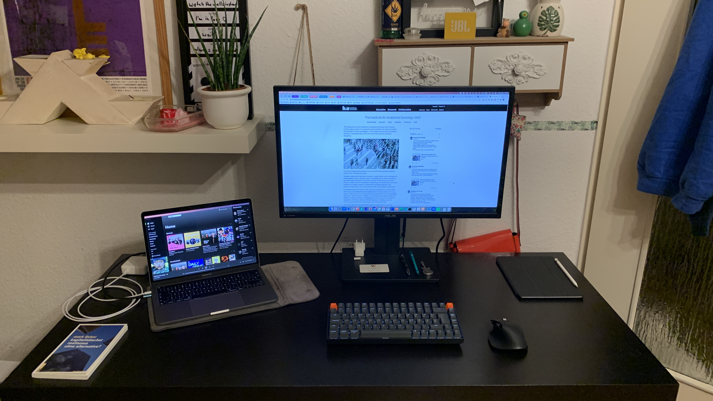

There are possibly as many workflows out there as there are people on this planet. So, naturally, your workflow is different from mine and no two workflows are the same. However, in every workflow there are some hindrances, and by looking at how other people work this helps us to identify those bottlenecks and close them – well, at least if that’s possible. Right now, at this very moment, my biggest bottleneck is the limbo I experience between furthering Zettlr’s 2.0 version (which I am typing this article in) and the current official release 1.8.7, which is more stable, but actually not as fast and straight-forward as the new one. So it’s a dance with the devil for me. But let’s put that aside – this first article in this series is actually not at all about software, but about the hardware I use to work with!

May I introduce? My desk.

As you can see, this is not my office’s desk (which even has the ability to move up and down depending on how I want to work!), and the reason for this should be obvious. However, this desk is the next-best thing. And – even though it’s just from IKEA – it has already survived four different apartments! It’s not as spacious as one might wish for, but given the fact that my whole workflow is pretty much digital nowadays (the book at the bottom-left corner is purely decorative) that’s quite okay. The most important thing after the desk, for me, is thus the display. But more on that later.

First, the circumstances: This desk is pretty much my whole world during these times, and I rarely spend any time looking at the thoroughly great decoration my girlfriend has put up (before my desk was there, to be fair). Still, this desk-setup is pretty much the same as I have in my office, except there I mostly use a Windows laptop and have a different set of keyboard and mouse. In general, the ideal setting for me is two screens, dedicated mouse and keyboard, and one of these screens should be 27 to 29 inches wide. With this, I am able to perform my day to day work given the apps I will be introducing in the following articles in a fairly efficient manner. Plus, given that I spend up to 100 hours a week sitting in front of this screen, this is as comfortable as it can possibly get.

But now, what can we see here?

## The Essentials

First, let’s talk about the three most important pieces of hardware that one needs as an office worker. You may notice that I left one thing out: The chair, which currently is the old one from my girlfriend. I never had any good chair, and I know I need to get one sooner rather than later. But right now, I’m still more or less comfortable with that one, although I can’t say which model that is. So I’m not going to talk about it, but remember: You’ll want something that fits your size, your stance, and should be comfortable to sit at for long hours.

### The Desk: IKEA Malm (Black)

The desk, as I already mentioned, is a fairly basic one – the black version of IKEA’s Malm desk. That is possibly one of the most frequent choices, and I can clearly recommend it. Although its depth could be bigger, given the large display I put up there, it’s nevertheless very good in size, with space for everything I might want to put up there (which does not include a lot of physical books). In fact, anything pretty stable should be sufficient, and even if you just get a piece of raw wood and stack it up on four pipes that is perfectly fine. Although I do recommend the drawer which comes with any desk worth its name.

### The Computer: Apple MacBook Pro M1 (2020)

The computer itself is the most expensive thing on the desk, maybe even in the entire room. It’s Apple’s newest piece of equipment: The 2020 MacBook Pro with an M1 chip (a.k.a.: a processor based on the ARM64 architecture). This was quite the gamble, because I have to perform a lot of computing stuff, as you might have guessed. The support for arm64 architecture across the software development world is not as good as one might hope for, but it’s still possible, [as I describe in this article](https://www.hendrik-erz.de/post/setting-up-python-numpy-and-pytorch-natively-on-apple-m1).

Was the stress of having to spend a few days setting up my development environment worth the risk? Absolutely. If you need to do heavy computations you will certainly benefit from the main CPU in this computer. Previous instances of Apple’s MacBooks as well as many, many Windows laptops feature dual-core Intel-based CPUs, because these tended to be a good balance between heat emissions and computing power. However, the arm64 architecture enables the production of _much_ smaller CPUs. So small, in fact, that instead of only two, the M1 chip has 8 cores. And 16 dedicated parallel cores (dubbed “Neural Engine”). And a built-in GPU.

When it comes to machine learning, a lot of people will recommend graphical processing unis (GPU) instead of the default CPUs that are built into all computers. The reason for this is that a GPU is much better at parallel computing of large amounts of floating-point operations. However, even though CPUs are much worse at machine learning tasks, if you have 8 of them, this does offset a lot of GPU power. While my MacBook is still not at all _fast_ when it comes to training more complex models, some anecdotal benchmarks with my colleague’s work laptop showed how incredibly fast this machine is.

So, should you spend up to, and more than $2,000 on a laptop? Well, it depends. It was quite the gamble, but it paid off for me. It doesn’t need to pay off for you. But if you do more or less similar tasks as I do, it’s definitely worth every penny. Keep reading my upcoming articles to see if my choice of software is remotely comparable to yours – then the chances are high you will also profit from this. Plus, always remember: The whole industry is moving away from the old Intel architecture towards ARM architecture, so you can expect that the application support for these things will increase steadily over the next years. If you don’t want to risk too much money on a (possibly) not fitting laptop, I still recommend Apple devices for everything that does not involve gaming, because they excel at every measure.

### The Screen: ASUS PB277 2K

The third central pillar upon which my work-efficiency rests is, obviously, my main display. I opted for an ASUS PB277 2K a few years ago, because it seemed to be a good balance between price and performance. There might be some friends of you who may tell you “but it only has 2K!” or “but it’s only 27 inches wide!” While these certainly are true, imagine what you actually need as an office worker, and what that display offers you.

The most important aspect is, in fact, the screen size. The 13 inches offered by most laptops nowadays is simply too small to be comfortable. It’s certainly possible to work on such a small display, but only for a short amount of time. After that, and in general, you will want to have a much bigger display. If you don’t believe me, try to find a friend who borrows you their big screen, and just give it a try. Even just the ability to comfortably place two windows next to each other _without losing a lot of toolbar buttons to the scroll bars_ is worth every micrometer of screen estate.

But what should you pay attention to if you are to buy a main display? First: Screen size. I do not recommend anything smaller than 27 inches. I have had a lot of different screen sizes in the past, but 27 inches is the first size that immediately appealed to me without having to get used to it before. Everything smaller always had some sort of a learning curve before I was comfortable using it. Bigger is, of course, always better, but anything above 29 inches might require special attention. For instance, I remember a former colleague of mine had one of these ultra-wide screens. I think his was about 1.5 metres in diameter which is far too wide for me. But then, the screen size can always increase with increasing distance you have from your screen. I, for instance, normally sit between 50cm and 100cm away from my screen, so 27 inches is perfect because I never have to move my head too much when looking into the corners of the screen. The further away you sit from your screen, the bigger it can get, obviously. And, if you perform certain work that requires you to have open many windows side by side, an ultra-wide display might even be the right one for you. But if you don’t know what you actually need, I’d recommend you start with a “regular” size instead.

The next, very important thing you need to pay attention to is the resolution. 27 inches is all good, but if your display only supports FullHD resolution the text will come across as mushy or pixelated. The bigger your display gets, the higher the resolution should be. I have spent some time thinking about whether or not I actually need a display with a 4K resolution, and possibly this would look better on my 27 inches, but after using it several years without ever experiencing eye strain, I conclude that the resolution of my main display of 2K is fairly good. However, with increasing resolutions (I think right now we’re getting 8K as the default) and increasing processing power, higher resolutions become more feasible, so you might want to opt for 4K. But unless you do serious video editing, anything above that should be considered overkill. And I want to underscore that 2K should be the minimum right now – I can count the pixels on my screen if I come close enough, and that’s something you don’t want to be able to do when just looking normally at your screen.

## The Peripherals

The second category I want to dive in today are the peripherals. They too are very central to a comfortable workspace, but as they’re normally referred to as peripherals, I want to stick to that convention.

### Keyboard: Keychron K2

As my main business is about writing, a good keyboard is a necessity for me. There are basically two major types of keyboards: flat and mechanical. Flat keyboards are the standard on laptops and these feature a variety of different mechanisms for your keys. These can be good (as in Lenovo’s ThinkPads) or extremely awful (as in my old 2017 MacBook Pro). The previous MacBook I had featured some very weird “butterfly” mechanism which made the keyboard incredibly flat, but that came at the price of a very unreliable typing experience. In fact, it got so bad that even tiny crumbles under my left Shift key made it a gamble of whether or not the computer would output an “A” or an “a.” However, those flat keys are the standard nowadays, even in dedicated keyboards, and many people I know really crave this experience. Such keyboards are quiet and can be pretty good for fast typing.

However, I opted for the “good old” mechanic keyboards. In fact, I bought a Keychron K2 keyboard, which is Bluetooth powered and features Cherry keys. What are Cherry keys? Simple: Cherry is a company that got famous by producing mechanical switches for keyboards that frequently are referred to by their colours (blue, red, or brown, for example – I have the brown ones). These mechanical keyboards were the standard just 20 years ago, and are currently experiencing a new trend because many people re-discover their versatility. And I must confess: I am much faster in writing on such a (loud) keyboard, because you have much more _mechanical_ feedback to whether or not you’re typing. The faster your typing gets, the more force you automatically apply to your keys, so the more stable the keyboard should be. Flat keyboards in general are not as sturdy as mechanical keyboards, so they may experience wear and tear much more visibly than mechanical keyboards. But, it does take more force to type on a mechanical keyboard to begin with, so if you’re typing rather soft, these may feel too hard for you.

In the end, whether or not you’re using a mechanical or flat keyboard heavily depends upon your own comfort, and this varies from person to person. Plus, there are other differences. A flat keyboard in general is pretty quiet, whereas all mechanical keyboards feature a “clicky” sound that is also rather audible.[^1] I don’t know of any person who has heard me type who has not afterwards complained about the noise I make, and my girlfriend sometimes seems as if she is close to a mental breakdown if she spends too much time with me in our living room while I’m working on a text.

But, mechanical keyboards have three great benefits. The first is that they are extremely durable. Because their mechanism is much simpler than those of flat keyboards, you can actually put in much harder materials that can sustain more. Second is that they are customisable. If you don’t want certain types of switches, or different keycaps, you can simply switch them out. This is much more difficult with flat keyboards. And third (and, potentially most important), you can easily clean them. Flat keyboards require a lot of mechanisms to make sure that the bigger keys such as space or the enter key respond well to being touched in different areas. These include many forms of metal pipes running from one side of the key to the other which help direct the force you apply to the actual sensor that registers a keypress. Mechanical keyboards require much less of these mechanisms. And thus, with less mechanisms to take care of, it’s much easier to take off the key caps and clean your keyboard. So if you’re craving food in front of the computer often, these might help you keep your house free from unwanted guests.

### Mouse: Logitech MX Master 3

Another important peripheral is, of course, the mouse. Even though I’m an Apple-only user, I really have an attitude towards those “Magic Mice” of Apple. Do I want the back of my mouse to be a trackpad? Certainly not. Do I want to take a gamble everytime I attempt to right-click? Nope. Do I want to simply not use my mouse every time it needs to be recharged, because the charging port is at the _bottom_ of that cursed thing? No, no, no! Instead, a mouse is still best if it comes with two visible, tactile keys, a scroll wheel, and possibly a few extra keys, just for the _æsthetics_.

I recently upped my game of mice with a Logitech MX Master 3, because of a few benefits it had: First it’s Bluetooth low energy (BLE), meaning it’s both wireless and requires much less power than my keyboard, for example. (Going wireless is pretty unavoidable right now if you’re an Apple user. But I feel that the wireless performance of all peripherals is extremely good, so I don’t miss the cables. Plus, all of my peripherals _also_ work via cable, if I really want to use one.)

Further benefits are that it’s pretty sturdy and offers a few additional keys for, e.g., navigating back and forth on pages in my browser. An additional benefit is the horizontal scroll wheel, which enables you to zoom in to barely readable graphics and scroll around them as if you were using your laptop’s trackpad. I didn’t actually need it, but now that I have it I’d really, really miss it if it weren’t there.

But the real game changer of Logitech’s mice is the standard scroll wheel. “Can you re-invent the wheel?” you might ask now. And Logitech certainly has answered this one with a firm “Yes!” The reason is that Logitech’s scroll wheels can be run in a detached mode, which means they spin freely without any resistance. My former, wired mouse also had such a mechanism (although it was mechanical back then, and now it’s based on electromagnets) which was the deciding reason for why I bough it.

Don’t see the benefit? Then please feel free to attempt to scroll across a 400-pages PDF file to find file 289. It’s much easier to just touch your scroll wheel and let it spin until you’re there than actually opening the “Go to page”-dialog, entering a number and then jump there. Believe me. Having the ability to detach your scroll wheel from its ratchet is a blessing. Thus, I’m more than happy that this ability wasn’t just a one-time experiment, but that Logitech has actually continued developing this.

### Tablet: Apple iPad 10’’

The next thing you can see on my desk is my tablet, which is an iPad 10 inches. It took me years of pondering before I bought one, because a tablet is in the end nothing more than a failed marriage between a laptop and your smartphone. A screen almost as big as your laptop’s, but with technology from your smartphone. Would you type long texts on your smartphone? I bet not. Would you like to only operate your laptop using its display? Hell no! So what are tablets actually good for?

Well, while I’m very much against this new trend of people buying Pro-iPads and pretend they can actually work on these things exclusively, the fact that they have the same format as books does make them a natural choice for reading without the distraction of your messengers, mail program, or something else. The big benefit of a tablet is that all apps work in full screen by default, so distractions can be easily avoided (if you don’t install your messengers on it, which I accidentally did).

Why did I opt for the regular iPad? Well, Apple has kind of a strange philosophy when it comes to producing tablets. They have the regular iPads, the iPad Air, an iPad Mini, and several types of iPad Pro. The iPad Air is just thinner, but more expensive than the regular iPad. The iPad Mini is – weirdly enough – also more expensive? And the Pros are … well – if you think you can actually work on a tablet, then these might be for you. But the regular iPad is actually the cheapest one, so I went with that one. After all, the only thing it must be able to do is display a PDF and play the occasional YouTube video.

However, a major reason for why I have waited so long with buying an iPad was one thing that almost no tablet could do well until very recently: Take notes and actually use it like you would a book.

### Pencil: Apple Pencil (1. Generation)

There is a video clip by Steve Jobs where he rambles about touchscreens and told the audience that Apple did experiment with touchscreens on Laptops once, but never shipped those because the testers couldn’t work with the touch screen well. So Apple went and simply improved the trackpad until it was one of the best on this planet. And if you generalise this remark, you end up with the following claim: “Every device is only as good as it is easy to use.” Translated to a tablet this means if you can’t operate it easily you’re better off with a laptop. And for a long time, that was true. However, after touchscreens became a thing, the next obvious development was to create a stylus with which you could operate it.

The first stylus were rather imprecise and relied on the fact that touchscreens work by determining your sweaty finger by measuring the electrical resistance on a special layer of glass. But since we’re now fifteen years after the inaugural smartphone, technology has advanced as well, and now we have an additional thing we can use: A rechargable, active stylus that works by communicating with your tablet to enable very precise drawing motions.

I have waited long years to buy an iPad because I needed that stylus, and my iPad is the first generation that supports Apple Pencils. And, lo and behold: These things are not just some overly priced gimmicks you never use! The Apple Pencil actually enables me to write like in a book – and I mean that literally. The current iPadOS ships with a handwriting recognition that – after a several weeks learning phase – becomes astonishingly good in deciphering your handwriting and transforming this into machine-readable text. So now whenever I read PDFs, it actually feels like reading an actual book: Same size, same look, and, due to the stylus, same feel.

I still think that maybe I bought something wrong, because there is the Remarkable 2, which features an Ink-display and thus is possibly better at being a tablet as the iPad. But still, having it has certainly enabled me to simply leave off my computer for a day or two and solely read on my iPad – in a comfortable chair far away from my computer. So, if you read a lot: Get a tablet that also has a very precise stylus. If not, then you might possibly be better off without a tablet at all, because for pretty much everything else, you can either use your smartphone or your computer.

### Decoration

It’s certainly important, but I have no eye for it: decoration. It’s important to look away from the screen from time to time (to be more precise: The recommendation is to look at an object 20 feet or ~6 metres away for 20 seconds every 20 minutes – the “20-20-20 rule”), but if ~~all you can see is just a yellow lemon tree~~ there is just a blank wall, then it becomes harder to do so.

That being said: I have no idea what kind of decoration you might want to put in the vicinity of your desk, but it should include something you like to look at. For me it’s mainly the photographs on the wall, but for you it’ll be something different. Oh, and you might want to get an office flower. That is, a plant that is so resistant to your plain negligence it will outlive a nuclear fallout.

## Concluding Notes

After way too many words, I hope that I was able to give you a first impression to the hardware I use and what I looked out for when I got it. In the next articles I will solely focus on the software I use. Don’t worry if you don’t use a MacBook, except one program everything works cross-platform so you can use it too. And, when it comes to Zotero, for example, you _should_. Yes, you _really should_. So stay tuned. And, apologies for writing so much, but as you can see, every utensil I’m using has its own story and I put a great deal of work into choosing my electronic devices. I didn’t think this article would turn out so long, but I promise the next onces will be shorter – because I’m not trying to squash in everything I own, but rather focus on one thing. I honestly didn’t think I thought so much about my devices when I began writing that article. But that’s all for now, cheerio!

[^1]: Wanna know how I got to purchasing a mechanical keyboard in the first place? Ben Eater is guilty as charged, because [he actually uses the sound of a mechanical keyboard to accompany the coding parts of his videos](https://www.youtube.com/watch?v=LnzuMJLZRdU)!
