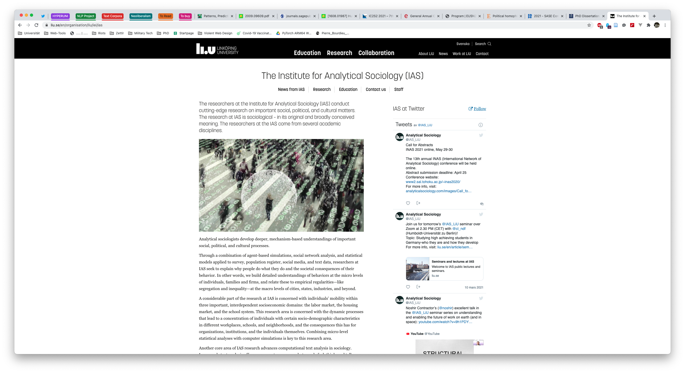

Yes, it’s kind of a low hanging fruit to first deal with the web browser. But since it’s also the app that is most active on my computer for obvious reasons, it’s also a very reasonable choice. Just a few years ago, the [browser wars](https://en.wikipedia.org/wiki/Browser_wars) were still fully engaged and users had difficulties choosing. Right now, there aren’t that many choices left. The reasons for this are manifold. For once, web standards are everything _but_ standardised. Every browser does its own thing, and to get one website to show exactly the same across all browsers is a task so daunting, people would rather spend a two-week holiday with your racist uncle instead of spending one minute trying to get _that one button_ to have the same height in every browser. This has resulted in many browsers simply being left to die in the wild, and while there are die-hards that still commit to, for example, Opera, the following statements are very much true:

* If you’re on Linux, there’s a >90 % chance you’re using Firefox.
* If you’re on macOS, there’s a 50:50 chance you’re using either Safari or Chrome.
* If you’re on Windows, there’s a >90 % chance you’re using either Firefox or Chrome.

However, Google Chrome is shipping for every operating system, so this post will be attempting to convince you to begin using Google Chrome despite its weaknesses. But first, the TL;DR:

## TL;DR

* Application: [Google Chrome](https://www.google.com/chrome/)
* Open Source: **Partially** (the browser part – [Chromium](https://www.chromium.org/) –, not the bells and whistles)
* Supported Platforms: macOS, Windows, Linux
* Alternatives: Mozilla Firefox (macOS, Windows, Linux), Apple Safari (macOS)
* Benefits:
    * Has support for the most advanced web features
    * Has the best support across all websites
    * Has the most useful extensions
* Drawbacks:
    * It will [eat your RAM](https://knowyourmeme.com/memes/google-chrome-ram-hog)
    * No, seriously, it will literally [eat your RAM](https://knowyourmeme.com/photos/1501182-google-chrome-ram-hog)
    * It’s good in draining your battery
    * It’s from Google



## Why Google Chrome?

So, I’m a strong supporter of Open Source. Why should my main application not be open source? There are several reasons for this, and some of them might affect what you want and don’t want to do as well. So let us go through these one by one.

### Chrome Drives Most of your Work Apps and is Most Compatible

One big reason for using Chrome is that we all are using Chrome in disguise. The reason for this is the application framework [Electron](https://www.electronjs.org/), which enables developers to build desktop apps using web-technologies. Basically, an Electron app is just a web browser that shows you only one website (the one shipped with the app). And it’s everywhere. Do you use Slack? Then you’re seeing a Google Chrome website. Do you use Microsoft Teams? Same. Skype? Sure is! Discord? Yep, even Discord. A lot of first-class applications nowadays are Electron-based, so you have Google Chrome on your system whether you want it or not.


So why should you use Chrome based on this argument? Well, the reason is a little bit tricky, but in general it has to do with what web developers do. Chances are very high that the people that wrote the websites you use most are also using Google Chrome privately. Chrome is so ubiquitous in developer circles that you can expect most websites to be developed on Google Chrome. If the people creating the websites you use are motivated, they will extensively test their websites on all other major browsers as well. But many just don’t have the time, so to be sure, it’s always best to stick with the choice of the people who make what you consume and use.

One piece of anecdotal evidence: A few months ago, I figured I need a startpage (now I don’t anymore, but there will be a time I want to have it again). [So I wrote one](https://startpage.zettlr.com). A friend of mine also wanted to use the startpage – super cool, because it gives you a feeling of validation. However, she uses Mozilla Firefox. And a lot of HTML5-Elements I supposed would work there as well didn’t. Using a Time-input element to quickly select the time? No chance. Actually, I figured that there is literally no standardisation in these things, and they act completely unpredictable. So if one input element doesn’t work on Firefox, chances are high it will work as expected on Chrome. Check this input out here to test it for yourself:

<input type="time" value="20:00" onchange="document.getElementById('time-result').textContent=event.target.value">

The field’s value (modify the input to see it; should be something along the lines of 20:00): <span id="time-result" style="font-weight: bold;"></span>

If you test this out with different browsers, it will look differently depending on the browser. (I just figured that I didn’t even have Firefox installed so I can’t spoiler what it will look on Firefox, but I know it’s different.)

For reference, here’s the same code I used for the input:

```html
<input type="time" value="20:00" onchange="document.getElementById('time-result').textContent=event.target.value">

The field’s value (modify the input to see it; should be something along the lines of 20:00): <span id="time-result" style="font-weight: bold;"></span>
```

### It Syncs your Data

This might be a stretch, but let me make my argument: I’m a heavy user of the synchronisation feature of Google Chrome. All my browsing history, extensions, and bookmarks are synchronised across all installations where I’m logged into Google Chrome. And I really love that feature. Whenever I install Chrome somewhere, I don’t have to manually remember all extensions I need, the settings, or my bookmarks.[^1]

“But then Google has even more data on you! How dare you?!” you might think now. But when it comes to data privacy, I follow the approach: Let the state handle this. People always crave for data, data is always cool to have, and it’s fascinating. Believe me, I’m a data scientist, so I like to have swathes of data for myself. And this is not likely going to change. But if you prescribe what data people may actually use, and how they must store it, then it’s much easier. In the European Union, we have the GDPR which pretty much gives users the launch codes for a nuclear missile. And since the Safe Haven-agreement ran out some time ago, it’s even binding for US companies, so if I want them to delete my data, Google would need to comply if it didn’t want to breach international law.

“But they won’t care because the EU has no jurisdiction over Google!” Yeah. But, so? Google likely has more data on you than you think, and giving them a little bit more is not actually problematic. As many studies have found, the real culprit are _metadata_ — so not the actual contents of whatever data Google has, but the circumstances under which the data was created. I personally think it’s fine, because my data will be just a single drop in an ocean of data they have, and they don’t have any reason to pick me specifically. Unless I do something illegally. And then, Google won’t be the ones interested in my data, but law enforcement.

In this regard, I may be somewhat reckless with my data, but I feel the balance between data privacy and convenience rules this one in favour of convenience. But I’m sure many will disagree, and then switching off the synchronisation is also a viable option. Because if you’re not logged into Google Chrome, Google won’t get any data on you anyway except the data it would get either way, by you visiting websites.

### It’s Tab Management is Awesome


A last thing I want to put up for Google Chrome is the tab management. In Chrome, it’s super easy to manage your tabs without the need for any extension. Here’s the rundown:

* You can **pin tabs**, which’ll make them un-closeable and float them to the left of your tab bar. This is extremely useful for sites you visit frequently. I have only pinned Twitter, because I’m an academic and I have no life.
* You can not only rearrange the tabs by dragging them horizontally, but you can also place them in their own window by dragging them out of the tab bar. This way you can **move out a few tabs into a new window** extremely fast.
* You can **group tabs**, and give these groups names. With a click on a group label you collapse or uncollapse all tabs at once. This helps you keep tabs you need, but aren’t worthy of a bookmark. It’s sort of a “soft” bookmark, because once you close the tab it’ll be gone, but you can still hide the tab somewhere.
* You can drag these groups as well, so that you can move these tabs to their own window.
* By the way, **merging windows** also moves by simple dragging.


Why am I telling you this? Because I recently tested this out with Firefox, and it’s a mess. It doesn’t really work. Plus Firefox’s interface looks more cluttered than Chrome’s, so tab handling is – in my personal opinion – much better on Google Chrome.

### Conclusion: Let the Data Crawler In

I know that many don’t fancy Google Chrome due to its developers’ data munching, but weighing up all the factors – even if you’re not a web developer – Chrome is just the best browser out there. It does have its shortcomings, but so do other browsers, so even if you want to be privacy-first, Chrome should be your go-to solution.

I didn’t really go over my bookmark management, but that’s because I almost never look at these. Notable are only a few folders. First, “Web-Tools”, where I collect a host of handy online services, such as a quick iCal manager or the [Carbon app](https://carbon.now.sh/) for quickly creating code screenshots in a more beautiful way than to do a screengrab. I think I’ll also introduce those services in this series, because I just found out that these things are a) hard to find and b) there’s no reference list of them, which is a gap I feel the need to fill. The second bookmarks folder worthy of interest is “PhD” because that’s the one I actually use the most. I collect there pages and info on my PhD program, because those pages are more important than group tabs, so I want to keep them. A third one I am actually collecting for a post is “Violent Web Design.” What’s in there? That’s a surprise, but as a little spoiler; I’m always on the watch for the most ugly websites on the planet, and since the Indian government overhauled their websites a few years ago, I cannot point my finger at those websites anymore. But believe me, these were fascinating – all blinky GIFs and pop-art colours![^2]

But that’s all for now! See you next week! I promise until then I’ll have figured out which app to present next!

[^1]: Did you know there’s no real format to output bookmarks in? So if you’re exporting bookmarks it’s just an HTML file, and you’re lucky that browsers are able to read in this file. This is not naturally true.
[^2]: Lucky me! I just went back to the main page, and _at least_ they [still have ugly, pixelated photos](https://www.india.gov.in/).
