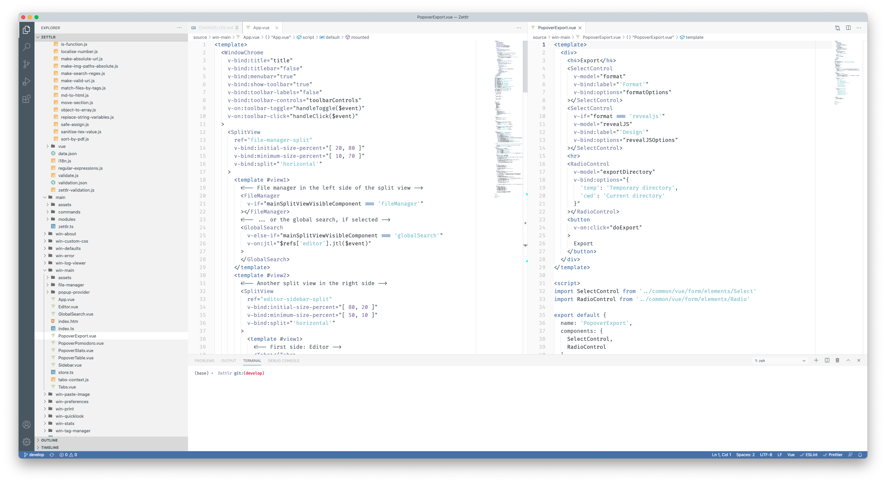
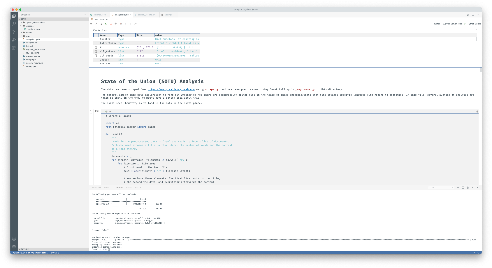

In part III of the series on how I work, I want to focus on an app that I recently used _a lot_. And by “a lot” I really mean a lot. The app was open almost 24/7 and I was very busy typing in thousands of lines of code. The reason for this is that I just finished a course on Natural Language Processing (NLP), and as such, a big part of the intended learning outcomes was to write good code in order to perform said NLP. And when it comes to both data science and programming, there is one app I have come to adopt for both tasks equally much: Visual Studio Code. So let’s see how I work with it and why it’s the perfect fit for my workflow!

## TL;DR

* Application: [Visual Studio Code (VS Code)](https://code.visualstudio.com/)
* Open Source? Yes
* Supported Platforms: macOS/Windows/Linux
* Alternatives: [Atom](https://atom.io/), [Sublime Text](https://www.sublimetext.com/), [Brackets](http://brackets.io/) (all cross-platform)
* Benefits:
    * Comparably light-weight
    * Huge amount of extensibility
    * Large versatility for numerous tasks
* Drawbacks:
    * Weird default settings
    * Hard to find good light themes
    * Some un-intuitive design choices
    * It’s from Microsoft

## VS Code is Good for Specific Use-Cases

So, let’s spotlight the different use-cases I have for the app. In general, VS Code can be seen as a plain text editor that also enables you to perform syntax highlighting, if you want. Furthermore, it can – with the right extensions – open almost any file on your computer (although you don’t really want to do that, since most other programs are more suited for certain file types). However, obviously VS Code is mainly intended as a programming IDE. For that, however, you need extensions.

Overall, the general idea behind VS Code is very good: You get a text-editor only that can open plain text files. Also, it features a built-in file management. But other than that? Not that much. So, with a basic installation of VS Code you won’t get very far – and for pure plain-text editing, it’s way too overweight, since it’s an Electron app. That being said: The most important question when considering to try out VS Code is: **Do I have a specific use-case for this app?** If you do, you’re good to go.

## General Features

But first a few general features that are pretty good suited. The first one is the **integrated terminal**. Instead of having to open a terminal in a separate window, VS Code lets you open a small terminal within the main window. This is mainly useful for when you have limited screen estate (e.g. when travelling with your laptop) or when you don’t _really_ need the terminal (e.g. you just run your application in debug-mode but the console output is not important). This terminal instance can be pretty much configured and uses your operating system’s terminal (so in my case iTerm, on Windows PowerShell, and otherwise some form of Terminal application that runs on ZSH or Bash). While it does not have all the bells and whistles of your favourite console, especially if you have customised it quite a bit, the terminal should have enough fancy features to make you use it quite often once you figure out ways of fitting it into your general workflow.

Another feature is the decent **git integration**. While I’m in general not that happy with using Git in a GUI (mainly because it swallows a lot of possibly useful output), for some very common tasks such as committing changes it’s very good. In fact, I rarely commit any changes on the command line anymore. Especially to see which files are modified, untracked, or removed, a graphical user interface is in fact better than running `git status` manually. Plus it makes correcting spelling mistakes in your commit message much better.

A last feature that is very handy for development tasks is the command palette that you can open by pressing `Cmd/Ctrl+Shift+P`. It is basically a small text field that you can use to issue commands provided for by VS Code or an extension. For many not-that-often-used commands it’s very easy to search for the command and execute it. One of these commands is to install the shell command “code” to your PATH. As soon as you run it, what you’ll be able to do is go into your terminal, and in any folder execute `code .` to have that folder open with VS Code. You may not think that it comes in handy often, but when you know you _can_, it’s extremely helpful being able to just type that into the terminal while navigating your computer using the terminal.

## Developing with VS Code

My first use-case is programming. Since I do a lot of Open Source development on the side, it’s only natural that I use a good code editor for that. Originally, I started out trying Atom and in between a little bit of Brackets. However, Atom was always a little bit bloated and sluggish and Brackets doesn’t really provide good extensibility, since it’s mainly intended for web design purposes.

Initially, when VS Code was first introduced, I was strictly against it, because quite the hype ensued, and I’m generally averse to hypes, since these tend to ebb away rather quickly and you’re back to square one. Also, I don’t like Microsoft. Just take a look at my Twitter timeline to get enough reasons for this. But since VS Code didn’t prove to be just a hype and has since become the de-facto industry standard, I switched over a few years ago. While I was still not doing my PhD, I only needed VS Code for coding and programming, so I already figured out a good set of extensions to use for certain programming tasks, which I’m going to introduce here.

Now, how does VS Code hold up when it comes to actual developing work? I mainly develop in Node/Electron- or Python environments, so these are the two main languages for me. Here I have to say that VS Code works extremely well. It has support for any linter, and for most programming languages there are extensions enabling the language-specific linter. This means: A few clicks and your linter is set up. Similarly, especially when it comes to performing _common tasks_, a lot of extensions are there to help.

However, I have to confess that I’m still pretty manual. This is because in some regards, VS Code is a little bit too eager with automatically doing stuff for me. Thus, I prefer to run several things on my own, such as pushing and pulling from git, or debugging. This is mainly because I have a (possibly completely unjustified) fear of missing one or two automatic changes I do not want before committing them to the repository. But where I make use of VS Code’s automation, it’s always a delight. A built-in colour picker for CSS colours? Check. Snippets and autocomplete for multiple languages so one doesn’t have to figure it out oneself? Also check. And, as I mentioned, for everything that does not come built-in with VS Code there is a high chance that there’s an extension for it. And since these extensions are written in JavaScript and can make use of the extensive plugin API of VS Code, these tend to be very lightweight. My 25 extensions add up to something over 300MB, but that’s mainly because I have both the Python and the Jupyter extensions installed, which make up for almost half of the space. Most extensions weigh only a few hundred Kilobytes. And I only need the Python and Jupyter extensions for my data science workflow, not for my pure developing workflow. And, especially when you think about the several Gigabytes that regular IDEs sometimes have, even half a Gigabyte is absolutely lightweight for the amount of features you get.

When it comes to experience: I can safely assure you that VS Code is one of the best choices out there for developing for the web (including Node and Electron), PHP (here I mainly focus on Laravel), and Python. I haven’t programmed in Rust for quite a while now, but I can’t remember any bad experiences either, so even if it’s not _the best_ choice for Rust, VS Code still holds up pretty well.

## Data Science with VS Code

The next big block of tasks I use VS Code for is data science. I do data science exclusively in Python right now, since it involves a lot of machine learning tasks which are much better supported in Python due to the existence of frameworks such as Scikit, PyTorch, NLTK, and Tensorflow. The main extensions I need for this are the Python extension by Microsoft, and the accompanying Jupyter extension. Both work well together to enable the two main things I do when I do data science.

Whenever I scrape some data, or have to do some automatic tasks of data-transformation, I tend to write standalone Python files. These don’t look very nice, but they do the job efficiently. I write some code, have much more advanced Python features at my disposal, and – most importantly – I can organise my files much better than I could with stand-alone Jupyter Notebook files.

However, once it gets to performing the actual analysis of the data, I switch over to Jupyter Notebooks, and interleave Markdown-based notes and interpretation with interactive code that I can tweak until I get the analytical results. Since data analysis is a back-and-forth between explaining what you would like to do, think about the code, and write new code, it’s usually much better to do so in Notebooks as opposed to comments in code files; not only because this is reminiscent of RMarkdown files – which basically work the same, only using R instead of Python –, but also because this way you have more abilities to express your thoughts. And: Notebooks can display plots, so that you don’t have some windows floating around your screen when you’re performing data science on the command line. All in all, it’s just a much more pleasant experience.

“But why should you download a 100MB extension and a 300MB program for this, if you could simply do this on the command line?” those of you experienced with Jupyter might ask now. Well, to be sure: You can achieve the same results either by downloading Anaconda – but then you have a lot of stuff you don’t necessarily need, because Anaconda is a very large distribution – or by installing the `jupyter` and `notebooks` extensions manually in your Python environment and start them by running `jupyter notebook`. But then you have a terminal and the notebooks are browser-based, so you have at least two windows open. By running everything in VS Code, you only have one window. Plus theme support (which is abysmal in vanilla Jupyter[^1]), since the Jupyter extension obviously uses whichever theme you have currently selected in VS Code. Plus, it works much better, since the extension can install the IPython kernel for you with the click of a button. A lot of things are much more pleasant when using Jupyter with VS Code.

## Recommended Extensions

So now it’s time to go over the recommended extensions I have installed.

### Auto Close Tag

A small and simple extension that adds smart auto-tag-closing features to VS Code. Since tags are only part of HTML and XML, it’s a little bit weird that we need an extension for this, but anyways, it’s pretty lightweight and extremely useful. Especially if you do a lot of HTML development, which I happen to do.

### Beautify

This extension is somewhat more heavy, but it’s also pretty powerful: Just run one of the available commands in the command palette of VS Code and it will order your JSON-, HTML-, JavaScript-files, and many more. Comes in especially handy when copying a lot of code and the intendation is wrong.

### ESLint

If you work a lot with JavaScript or TypeScript, this extension is a must have: It simply adds support for JavaScript’s ESLint linter to VS Code so that errors and warnings are shown directly within the code. You still have to install ESLint yourself in your repository (read: run `yarn add eslint` or `npm install eslint` manually), but as soon as you did that, all errors and warnings will be shown using wiggly lines as you type so that the chances of accidental bugs are very slim.

### Excel Viewer

Guess why I want to have that extension? Right, sometimes, data is unfortunately in Excel files, not in TSV or CSV files. So whenever I have those and just want to take a look at the file, this extension comes in handy. To be sure: I could use Excel for that, but most of the time, this extension is faster in loading the files, and since I don’t want to edit them, this is definitely the way to go.

### HTML CSS Support

Just a minor addition, but having code-completion for CSS classes and a few warnings for, e.g., empty rulesets, comes in handy sometimes. Especially once your CSS-files grow to a certain extent (but you might want to consider LESS or SASS files then, either way).

### Jupyter

As I have mentioned above: An absolute must have for the best Jupyter Notebooks-experience there is!

### LaTeX language support

A handy extension that definitely makes my life a little bit easier when I need to edit some LaTeX files directly instead of using [Pandoc](https://pandoc.org) for that. This extension provides LaTeX syntax highlighting and also adds some code snippets which definitely come in handy when writing TeX code.

### Markdown All in One

This extension adds Markdown shortcuts and a few other goodies for Markdown. Since most READMEs are written in Markdown nowadays and I do have to edit the occasional Readme, it’s easier to do so directly in VS Code for the most part, rather than having to spin up Zettlr. So for these occasions, it’s cool to have some shortcuts for inserting links or making text bold.

### open in browser

Yes, there’s an extension to open HTML files in your default browser. This is not in the VS Code base setup. Don’t ask me why, but this extension doesn’t cost any money, so it’s good to have, just in case. Simply right-click any HTML file, select the appropriate option, and you’re good to go.

### Prettier – Code formatter

For all the file types and languages where Beautify can’t handle the syntax, there is Prettier.

### Python

As said above: The Python extension is pretty much essential if you do a lot of work using Python. PyLint – Python’s linter – and other goodies are enabled by this one-stop extension.

### Rainbow CSV

Remember I don’t like Excel? Well, guess what: CSV and TSV files are hard to read by themselves. This handy little extension adds syntax highlighting to CSV and TSV files so that you can preview them almost as Excel files. And when your column labels are too long for your data, it also offers the ability to justify all cells so that it really looks like an Excel file. And if you want to edit these files, the extension does provide some cool commands for this as well!

### SVG

SVG-files are basically also source code. But most of the time, you also want to preview these things, especially if you have to manually adapt them and don’t have Adobe Illustrator installed. In these cases, the SVG extension comes in handy – not just because it offers better support for writing SVG files, but also because it gives you the ability to preview them in VS Code without the need to rely on any external program.

### TODO Highlight

A simple extension that does precisely that: You define some words which will be highlighted using CSS-classes that you define. For me, this means a lot of “TODO”s, but I also highlight DEBUG, BUG, and NOTE for other important things I mention in my comments. Additionally, it searches all files for these words and lists them in a handy way.

### TSLint

If you have ESLint, chances are you also want TSLint. It’s the same as ESLint, but for TypeScript. It also requires you to have your own TypeScript installed, but the extension itself is extremely small. So you won’t waste any disk space!

### Vetur

Vetur is an extension that provides a lot of out-of-the-box support for developing with the Vue.js framework. I need it quite often, but if you’re more the React-person, then obviously this won’t be for you. (I do recommend Vue, though.)

### VS DocBlockr

An absolute essential for everyone. I know, many programmers are lazy and don’t want to comment their code, but this little extension makes it as easy as it can get: Just begin a doc-block comment (for many languages this means to write `/**`) and this extension will read what the function below the line expects as arguments, and what it will return, and you can then `TAB` through the pre-filled comment block to document everything your code does. Absolute essential.

### vscode-pdf

Since VS Code is just a browser, and since a browser has `pdf.js` already installed for displaying PDF, why not make use of this ability in VS Code? The extension is ridiculously small, since it basically just opens a PDF file instead of code, but it has come in helpful many times when there was a PDF in my repositories. (Mainly useful for the data scientist in me, obviously.)

### Vue 3 Snippets

Despite the name, it also features code snippets for Vue 2, which I mainly use. So if you have Vetur, then you should also get Vue 3 Snippets, since it’s made to work alongside that one.

### Other Extensions and Themes

There are many more extensions available which I currently don’t have installed, since I don’t need every single piece of functionality, which are nonetheless recommendable. But I will postpone this until I actually need them, which is when I’ll for sure be writing another blogpost.

When it comes to themes, I’m a little bit sad about VS Code, since the community is one of those groups which hate light modes, so it’s extremely difficult to find good light themes for VS Code. I actually mostly use the default themes shipped with VS Code. But when it comes to dark themes, there’s a plethora of (good) themes for working at night. Since I don’t actually have a distinct preference yet, I’ll just list them here for you to explore:

* Ariake Dark (my current go-to dark theme)
* Ayu (combines multiple themes in one extension)
* file-icons
* Horizon Theme
* Rainglow (this actually installed a pretty large variety of themes, but none of them really appeals to me)
* SynthWave ‘84

## Drawbacks of VS Code

Of course, VS Code has a few notable drawbacks which I should mention here. The first one is not so much a drawback, but rather a recommendation: Go through VS Code’s settings the first time you run it. Both to disable sending Microsoft all of your telemetry, and because a lot of the settings are not really the best practices for both programming and data science. Fortunately, you have a wide variety of settings available to customise VS Code. Additionally, if you enable some of the extensions mentioned above, they will by default run experiments on your computer, which you have to opt out of if you don’t want this.

The second drawback is that sometimes VS Code has weird behaviour and questionable design decisions. For instance, if you have one repository open, but open one single other file from a different folder with a different git repository in it (because you need to look something up or so), it will open that repository in the repositories tab as well so that you have two repositories open. That is completely undesirable but I haven’t yet figured out a way to stop VS Code from doing that. The only thing I can do right now is manually close these again after I have closed all files from the other repository, because _of course_ VS Code doesn’t do so itself. There are some more not-really-thought-through decisions, but all in all they are manageable.

## Conclusion

I remember myself saying “The next posts will be shorter, promise!” and now I have again more than 3,500 words. It really turns out that the decisions I put into my hard- _and_ software are indeed well thought through. Or maybe I just can’t write short and concise. Which may have to do with me being a social scientist; we do carry that stereotype. I leave that for you to think about until next week!

[^1]: To be fair, the vanilla Jupyter notebook server does have theme support, but that requires you to a) install an additional package and b) run the `jt`-command every time you would like to change the theme. And that’s just not going to happen.
