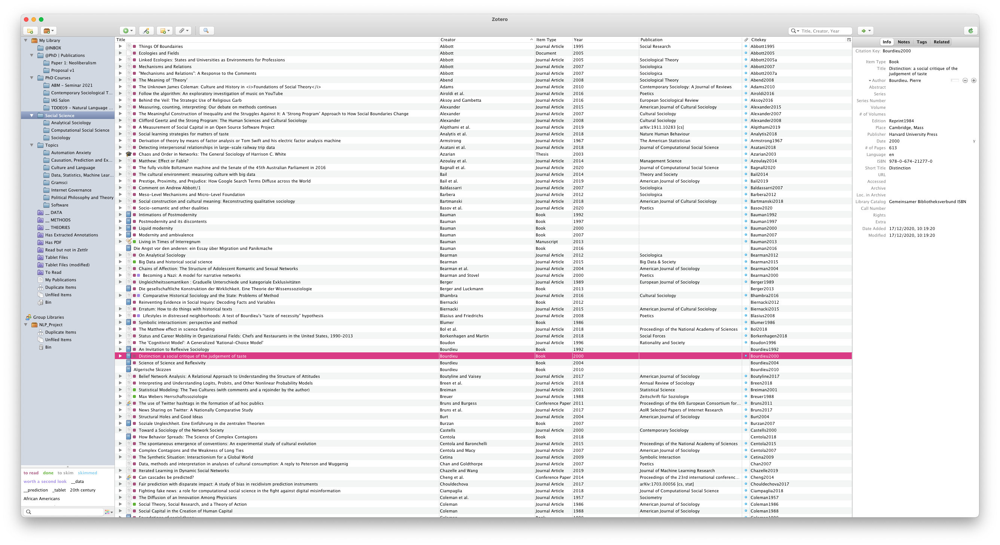
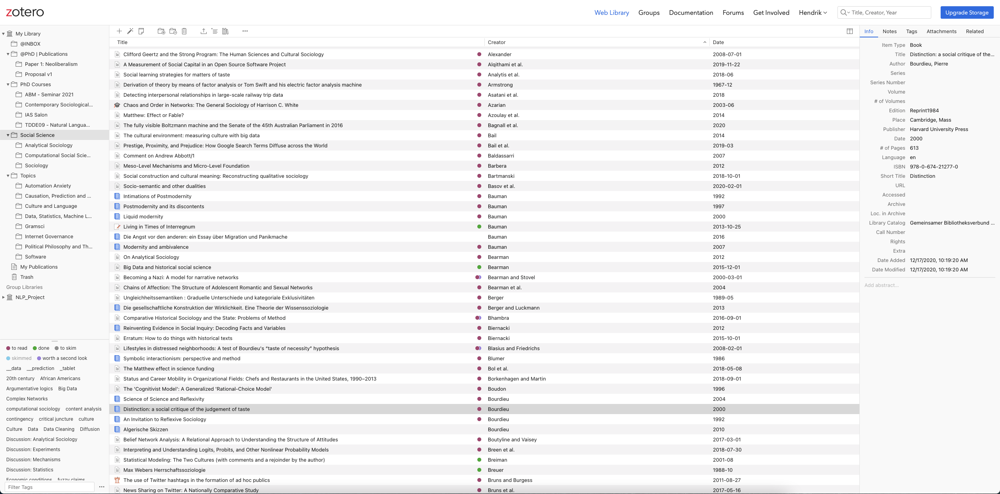
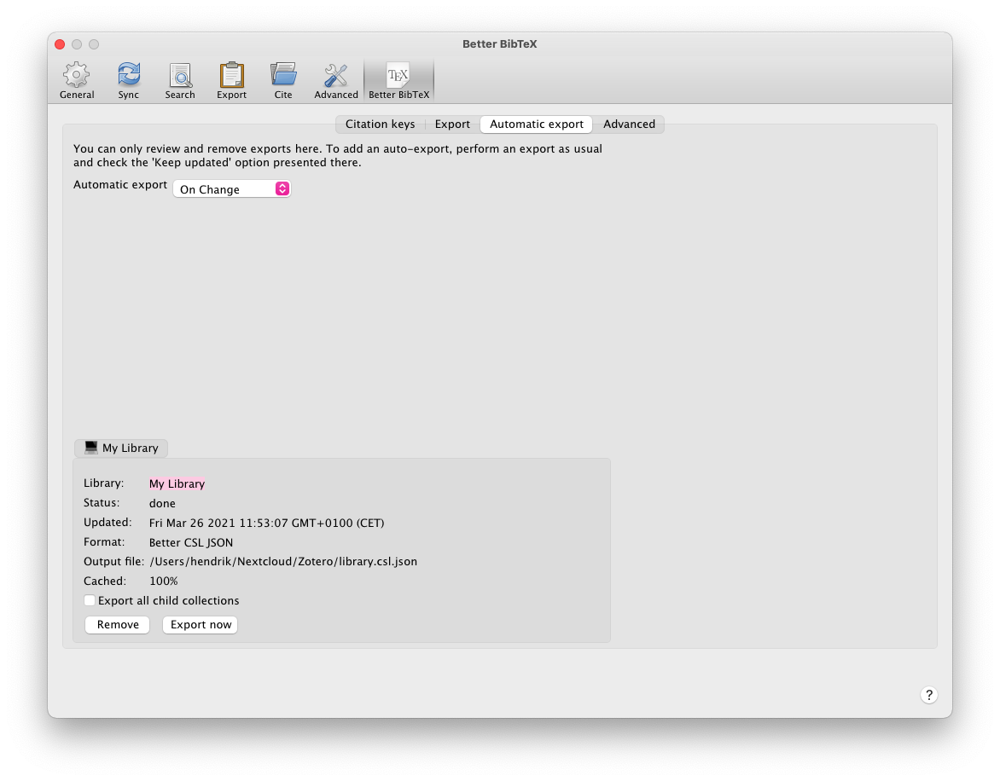
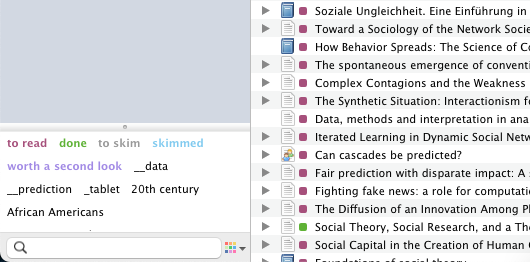
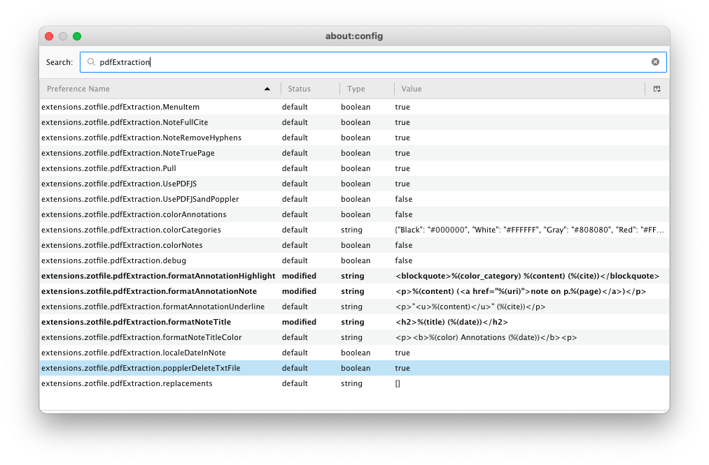

Reference management is something academics can discuss with an amount of enthusiasm seldomly seen in scientific contexts. This certainly has to do with reference managers being one of the most fundamental aspects of any digital writing workflow. Every academic needs to read papers to do science™ and due to the sheer amount of texts to read, managing them becomes inevitable very quickly. There is a multitude of reference managers out there, but none is any good for managing references, so Zotero, which I use, is pretty much without alternative. Is this provocative? I hope so! Continue reading to see why I think this way!



## TL;DR

* Application: [Zotero](https://www.zotero.org/)
* Open Source? Yes
* Supported Platforms: macOS/Windows/Linux
* Alternatives: [JabRef](https://www.jabref.org) (macOS/Windows/Linux)
* Benefits:
    * Central reference management with everything you’ll ever need
    * Online-synchronisation and collaborative work
    * Plenty of plugins for the picky researcher
* Drawbacks:
    * Due to historical reasons Zotero looks and feels a lot like older versions of Firefox
    * It doesn’t support dark mode :(
    * It’s sometimes a little bit sluggish

## There Is No Alternative

First things first: Why the heck am I so provocatively stating that there is no alternative to Zotero (except JabRef)? Normally, I’d always say “Hey, you do you!” because even if I found some other software not as helpful, it was still an alternative, and who am I to judge _your_ workflow, right? Well, with reference managers there are several reasons for why this doesn’t apply.

What normally counts as an “alternative” to Zotero is software that is completely useless and ridiculously wrong in so many aspects. One of the main reasons for this is that the reference manager market is flooded by companies that try to make academics pay for having a decent reference manager. Another main reason is that many of the “free but pay-to-win”[^2] reference managers are being developed by those companies we, as academics, hate for locking away our publicly financed research behind ridiculous paywalls.

First, one often-cited example is **Mendeley**. Why should you throw that one out of the window as soon as possible? Well, first it’s being developed by Elsevier, one of the most egregious actors within the business of paper-monetarisation. They will force you to create an account with them in order to use the software. So, the account is free and I once actually tried that out. I then realised it’s not that cool, and tried to delete the account. And guess what? They told me I should call Elsevier and ask whether they are willing to delete my data. “You kidding?” Nope. That account still exists somewhere in their systems, and let’s put it mildly: This experience didn’t make Elsevier a better company in my eyes. Furthermore, Mendeley is simply a fork of Zotero. So by installing Mendeley, you basically get a shitty version of Zotero for no added benefit and a plentitude of problems. So just don’t do it.

Then, the second-most cited example is **EndNote**. It’s a proprietary program that costs about 300 €. Do we, as researchers, have that money? Yes, quite likely. But not after we’ve paid our rent. And if you want to upgrade, you still need to pay more than 100 €. So, is it worth the risk? I’ve realised that especially professors and more older academics swear by its benefits. However, due to limited funds, it’s pretty unlikely that you will get a license from your university. And let’s suppose you get a free license from your university: What will happen to that data after you switch to a university that does _not_ have a license? Right: You’ll end up in what is called a vendor lock in and to which I have dedicated quite a large part of [my video on Open Source](https://www.youtube.com/watch?v=A7N4NJWtq-s). “But it has really unique features to improve research with!” you, an EndNote user might say now. To which I answer: Are these additional features so unique you can’t emulate them with Open Source? And, on top of that, worth 300 € and subsequently more than 100 € per (potentially necessary) upgrade? If you answer these questions with yes, bear with me, because there is one more reason that will make collaboration with others who don’t have EndNote so painful they want to throw your body into the sewer (except you’re the Prof, obviously. By the way, did I mention that most EndNote users I have encountered are Profs? Maybe there’s a correlation between using EndNote and living to see another day by being at the top of the food chain.)

To elaborate that reason, I have to introduce another “alternative” to Zotero: **Citavi**. Literally the Swiss knife for German-speaking academics. Citavi is heavily centered in Germany, Austria, and Switzerland, mainly because it’s a Swiss company[^1]. But, more importantly, it’s not cross-platform. It only works on Windows. To be fair – most researchers do use Microsoft Windows. But then, you’re locked in to using Windows if you decide to let Citavi do the heavy citation lifting for you. It’s not as expensive as EndNote, but, as I said, limited to only one platform. But now, what is the problem both Citavi and EndNote share when it comes to collaborating and, in general, the comfort of choosing from thousands of reference styles?

The answer is **[Citation Style Language](https://citationstyles.org/)**, or CSL for short. CSL is an Open Source initiative by some very cool folks who set to standardise citation management across all sciences. And they actually f\*\*\*ing did it! Citation Style Language is the de-facto industry standard, mostly because all the good citation managers (Zotero and JabRef) support it, text tooling supports it (Pandoc), and because it’s all over the place right now. If you want to ensure you can work with any random folk from some lesser known university, chances are that they’re using Zotero or at least something that supports CSL. Both EndNote and Citavi have their own, proprietary formats, and the last time I checked CSL support was abysmal (that’s one of the beauties of vendor lock in). You can define custom citation styles in EndNote and Citavi, but then you can do the same for CSL. And yes, [there is a _graphical_ editor](https://editor.citationstyles.org/visualEditor/) to do that as well.

So, even if you have a rich aunt who can pay for EndNote, or if you know for sure you will never use anything other than Windows, many people will hate you just because it’s impossible to collaborate with you effectively.

The last example I need to introduce to you as an _actual_ alternative to Zotero is **JabRef**. It’s a very good manager, and I’ve been using that as well for some time, and if I weren’t so comfortable using Zotero right now, I would actually have switched to JabRef a few years ago.[^3] The main benefit of JabRef is that you don’t have to create an account to collaborate with others since JabRef exclusively works with library files which you can share using some cloud provider, something Zotero can’t do. But then, I do trust librarians, and they are the ones who are in control of my user data. Yes, take that, Google! I like to give librarians my data more than to give it to you!

But now, shall we proceed to Zotero?

## Eat. Sleep. Read. Repeat. My Zotero Workflow

Instead of a general feature overview, for this post I want to focus on my individual workflow. That has two reasons: First, Zotero has an awful lot of features that are well documented, but second, as I mentioned in the introduction, I don’t actually use most features. And that is based on almost ten years of experience now.

When I set up Zotero on any computer, I generally follow these steps to set up the prerequisites to my workflow:

1. Install the plugins Zotfile and BetterBibTex
2. Configure the plugins
3. Log in to my Zotero account
4. Wait until the synchronisation finishes
5. Begin auto-exporting my library to CSL JSON
6. Work.

I only use two plugins because that’s all I need. Zotfile is the go-to solution for managing all the PDF attachments and is also pretty important if you make use of the online-sharing feature like I do. BetterBibTex is pretty good for making Zotero work with any arbitrary software that supports CSL (that is, Pandoc, or Zettlr).

### Zotero Terms and Concepts

While writing this article, I realised I need to clarify some concepts beforehand:

* A **collection** is simply a folder where you can put some references in. Collections are always contained within Libraries. You can also nest collections to build a hierarchy. If that helps, collections can be thought of as categories as well, since they’re not really folders on your computer.
* A **library** is basically the “root” of an account. You can only have exactly one personal library, and each group work you start where you share references with your colleagues is another library.
* **Keywords**, or tags, are exactly that: You can tag certain references, and Zotero can also auto-tag them based on the contents of the library catalogues where it draws the bibliographical information from.
* A **reference** is a single piece of work. It can be a video, a book, a book chapter, a paper – you name it.
* A **note** is an HTML-formatted document that is attached to a reference.
* An **attachment** more generally is simply some file that is attached to a reference.
* **Annotations** refer to highlighted text and comments within PDF files.
* A **saved search** is basically a filter that looks and feels like a collection. But it’s dynamic. Instead of manually dragging references into that saved search, it will update its contents based on some conditions you can define (e.g. having certain tags).

### Zotfile for PDF Synchronisation

Zotfile’s configuration has lots of possibilities, and can be tricky to get started with, but here’s how I do it:

.")

First, I make sure that all my attachment paths are _relative_, that is: I tell Zotero that it should not, in fact, link my PDF files to my references using their absolute path, but only a relative path. I do so by pointing Zotero to the base directory of all my PDF files, which is synchronised using my Nextcloud installation. This way, what will be stored by Zotero is only the path from that base directory to the actual file. In my case: `/<year>/<PDF file>.pdf`. Why do I do this? Easy: My PDF files are being synchronised externally, and I have two computers, my work computer and my personal one. On my work computer, the path to my PDF directory is `C:\Users\hendrik\Nextcloud\Zotero\PDF` while on my personal computer it’s `/Users/hendrik/Nextcloud/Zotero/PDF`. However, _inside_ this directory, everything is the same (`/<year>/<PDF file>.pdf`). So what Zotero will do is take the custom path to my base directory for each computer, and concatenate that with the relative path to my PDF files and voilà: It will find all PDF files without an issue!



I do this, because storage space on the free Zotero plan is limited to 200MB, and the last time I checked my PDF directory contained two Gigabyte of PDF files. My server has hundreds of Gigabyte available and costs me about 5 Euro per month (and it hosts a lot of other, nice stuff like this website). To be sure, if you don’t want to set up your own server, you can also go with Google Drive or OneDrive (urks!) or even Dropbox (double urks!). This way, I can store arbitrary amounts of references (reference storage is free) and arbitrary amounts of PDF files.

### BetterBibTex for Reference Connectivity

BetterBibTex on the other hand comes in handy when you need your Zotero to work with software for which there is no Zotero connector (so, basically, anything other than LibreOffice and Word). I use BetterBibTex to export my whole Library in one chunk as a CSL JSON file, which I can then pull into any program and use that to cite my references. For instance, my Zettlr installation always points to the CSL JSON file exported from my library so that I can quote everything with ease. BetterBibTex will make sure the CSL file will stay up to date and also ensure that all the citekeys (which are necessary to reference these works) are unique across my library. So it’s a one-time config and then you can basically forget about that.



### Step 1: Researching Literature

Now to the workflow. The first step is always to search for good literature. This, nowadays, is mostly done using the internet. So I always make sure to have the Zotero plugin for Google Chrome installed, and whenever I stumble upon a paper I need to read, I can click once on the Zotero plugin icon and it will save the item including the PDF file to my inbox. The “inbox” is a collection I have where I just stuff in everything to sort at a later time. It is called “@INBOX” because uppercase letters make it visually distinct, and the “@” will ensure it will always be sorted to the top of my library. This saves me some mental energy when I’m going done yet another rabbit hole of research. To be sure: If I already know where a paper must end up, I can select that collection instead.

After I’m done researching, I go on and tag all these works with “to read.” I do so because Zotero has a nice feature that allows you to assign colours to certain tags. You can only assign nine pre-defined colours (I looked into the source code, and you could, in principle, change these colours, so don’t ask me why you can’t yet). Why nine? Because that’s the amount of numbers you have on your keyboard. Once you assign a colour to a tag, you can simply select a reference and press that number to toggle the tag. My “to read” tag has the number 1, so whenever I press 1 while having a reference selected, this will toggle the tag on the reference. Plus, the tag’s colour will be shown directly in the list of references so that you have an easy, visual cue to the status of your works. I only make use of the tags “to read,” “read,” and “reading notes finished.” Thus, I have a traffic light system, and each text passes from red to green as I proceed with reading and working with the text.



### Step 2: Reading the Literature

The next step is to actually read the literature. There are two general ways I need to do so. I either double-click a reference which will open the PDF in my PDF reader, or I can use Zotfile to manage all those texts I want to read on my iPad.

If I do want to read something on my iPad, I can right-click a reference, and then choose “send to tablet.” What this means is that Zotfile will take the PDF file and put it into a pre-defined folder on my computer. Then, it will continuously check whether the file has been modified remotely, and, if it has, I can right-click the reference again and choose to “get from tablet.” Then Zotfile will automatically extract all annotations from the text and put them into a note attached to the reference entry.

This pre-defined folder resides in my Nextcloud, and I have set up the PDF reader on my iPad, PDF Expert (which I’ll cover in more detail in a later part of this series), to synchronise that specific folder so that I have all PDFs I need to read readily available. Zotfile also creates two saved searches which simply contain all the references with special tags that Zotfile manages. So if I want to see which files are currently synchronised with my tablet, I can just go into that saved search.

### Step 3: Getting the Annotations

After reading papers, I need to extract all my highlights and comments I added to the PDF. Doing so is ridiculously easy: Simply right click the reference and select the menu item to extract all annotations. This works pretty good, and Zotfile, which is responsible for doing so, adds some goodies such as automatic backlinks to the specific PDF-page which, upon click, will open the PDF file at the correct page for you!

However, the default markup that Zotfile uses is somewhat bad, so I had to figure out a way to customise it. To make the markup Markdown-compatible (so that I can just copy and paste it into Zettlr), I had to modify some hidden configuration entries. To do so, open up Zotero’s Preferences, click on “Advanced,” “Config Editor,” “accept the risk!” (uuuhh!) and then in the search field, enter “pdfExtraction.”



Specifically, you want to edit `extensions.zotfile.pdfExtraction.formatAnnotationHighlight`, `extensions.zotfile.pdfExtraction.formatAnnotationNote`, and `extensions.zotfile.pdfExtraction.formatNoteTitle`.


These are the three “templates” Zotfile will use to format your annotations. The “Highlight” option defines how highlighted text will look like, “Note” controls how your own comments look like and the “NoteTitle” option controls the overall header of the file (which will look something like “Extracted Annotations (date)”). I chose to transform them like such:

```
<blockquote>%(color_category) %(content) (%(cite))</blockquote>
```

… which will render highlighted text as block quotes (which they are).

```
<p>%(content)</p>
```

… which will omit the (in my opinion unnecessary) “note on p. XYZ” from your comments.

And:

```
<h2>%(title) (%(date))</h2>
```

… wich will just ensure you have correct heading levels for Markdown.

As you can see, `%(title)` and other values are actually variables that will be replaced with some content based on the actual PDF’s contents. You can find a list of these variables [here (search for `%(` on the page to highlight them)](http://zotfile.com/).

## Conclusion

And that’s it! After all the steps above, the next stage of my research process concerns writing, so the journey of my reading notes within Zotero ends after I extracted them, and continues in Zettlr. I don’t use any other feature from Zotero since, as I mentioned earlier, I only use Zotero to facilitate my reading process and enable me to cite references. For everything else, I have different applications that are better at their respective tasks.

Some final notes on what I use and what I don’t:

- I use collections only for coarse categorisation of my texts. The collections as you can see on the screenshots here are in many cases not older than a few hours, since I spent the last days reorganising my library. This categorisation is only for ease of access, most of the time I refer to my reading notes in Zettlr or search immediately by author or title if I search for a specific reference. Furthermore, these categories _will change_ many times throughout your career.
- Except the coloured tags I don’t use any keywords in Zotero. I tried that many times but I find it too cumbersome, since most of those tags – if they should make sense – will only come up _after_ you read the text. But then, why not directly tag your reading notes instead of the references?
- I don’t use the feature to add notes to references. I know a lot of people find that handy, but then I think managing notes and managing references are two completely different tasks, and as such I only have notes containing automatically extracted annotations. All the actual writing work happens in Zettlr, not in Zotero.
- If you want to start creating collections for coarse categorisation of your references, what I found incredibly helpful is to actually go through each single reference more than once. After you’ve looked at each reference once, you will have an idea of the latent categories in there. And in a second step you can then create these collections, before in a third step actually sorting your references. Funfact: The categories below “Social Science” are all empty, because I decided to write this article first.

[^1]: I just double-checked the Wikipedia article, and apparently Citavi has been bought by some US-American software giant only a few days ago. Life is hard sometimes.
[^2]: “Pay to win” means that you get the basic functionality for free, but the most useful features are hidden behind some dubious “pro” plans.
[^3]: Honorable mention: The folks from JabRef, especially Tobias Diez, are pretty active in helping me code for Zettlr. Thanks so much <3
