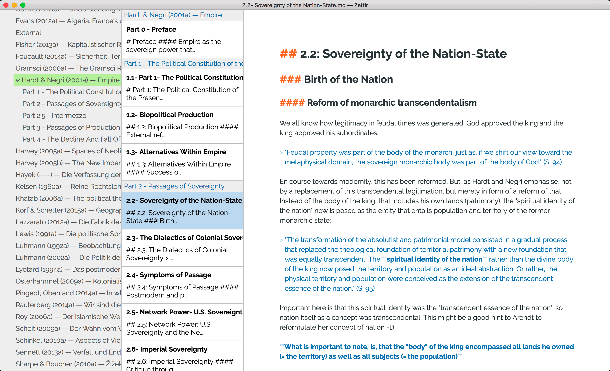
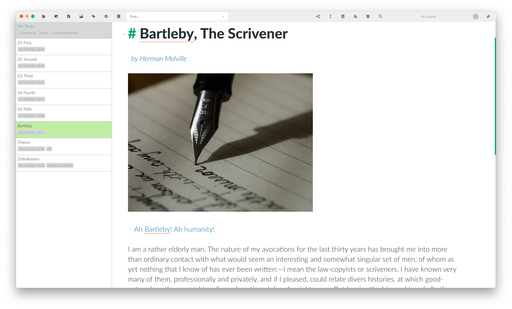

I have waited several posts to introduce the core building block of my workflow – not because I have no sense of priorities, but rather because it’s special in several respects. For starters, Zettlr sits at the heart of my whole workflow: Everything I read goes in there eventually, and everything I write (including these articles) emanates from it. But then, to complicate matters, it’s a tool I develop myself. So this article will be structured quite differently than the others.

. To the right you can see the table of contents. In general, Zettlr resembles word processors in many respects, but adds to them (note: this is a 2.0 development screenshot; the release will likely look different).")

## TL;DR

* Application: [Zettlr](https://www.zettlr.com)
* Open Source? Yes
* Supported Platforms: macOS/Windows/Linux
* Alternatives: The Archive (not Open Source, macOS, Windows), Obsidian (not Open Source, cross-platform), HackMD (not Open Source, online), VS Code (cross-platform), Atom (cross-platform), and many, many, _many_ more.
* Benefits:
    * Specific focus on academics and heavy text-editing (authors, writers, students, etc.)
    * Works with all the programs you probably already use for different use-cases (Zotero and JabRef, Word, RStudio, Python)
    * Strikes a balance between comfort and clarity with regard to display
    * Bundles many nice-to-have and important tools for writing (a Pomodoro timer, writing statistics, writing targets, a table editor, footnote support, reference lists, backlinks, Zettelkasten functionality, outlines, …)
* Drawbacks:
    * Writing quick notes can sometimes be cumbersome (as of now)
    * For maximal efficiency, you’ll likely need more of the tools I’m introducing in this series (for instance, Zotero)
    * Collaborating especially with non-technical academics will be a tad more complicated than before

## On the Origins of Zettlr

It all started almost four years ago, when I began discovering the benefits of a Markdown-based workflow and tested out various methods of making this useful for research. Already back then, in the summer of 2017, there were plenty of Markdown editors out there. I played around with Ulysses, nvALT, Atom, Abricotine, and some online-tools whose names I have long forgotten. However, none of these tools immediately appealed to me. And I think this had two main reasons. First, Markdown itself requires a completely different style of working than, for instance, a Word document. But then, since Markdown is, strictly speaking, source code, you could basically edit it even with your operating system’s built-in text editor.

So what I found was that there is a disconnect between a bunch of new opportunities that come with Markdown and the ways research works in general. And back in 2017, although Markdown was already 13 years old at that point, it was being used mainly as additional formatting for README files. All experiments with actually writing longer texts using Markdown were just that: experiments.

During the late summer of 2017, I played around a little bit with a framework I recently discovered, called Electron. Its idea is simple: Write a web-application, and load that into some binary so that it looks as if you had a native application on your computer. After fiddling around with it for a few days, I figured that I could both load in Pandoc and use it to have a graphical user interface for using it[^1], and also that I could spin up a code editor that lets me edit Markdown files. I realised that, instead of having to live with a subpar academic writing experience, I could forge my own. And so I began focusing on improving Zettlr more and more so that – in the end – I would have a tool for my academic workflow that “just works.”

What I didn’t realise back then is something John MacFarlane from the Pandoc project recently explained: An Open Source project of yours is first like your little baby: It’s something you made and of which you are proud. But then, a few months into development, it becomes more and more like an actual baby which you have to feed, that keeps you awake at night, and that eats away a lot of your time. But, since it’s your baby, you won’t give up on it. So you push forward.

Today, Zettlr has become one of the standard solutions for academic Markdown, and that makes me really proud. But it also shows me that I have accidentally put myself in a position of great responsibility: What I do will influence thousands of people. Each feature I implement might break someone’s workflow. Each minor function I remove to reduce clutter might make it impossible for people to work with the app.

However, there are also many things that make me confident that I have the support of a growing part of academia: Incidentally, especially university libraries are adopting the new possibilities of Markdown, offer workshops and begin to probe Markdown based workflows for their feasibility in academic workflows.

Libraries are the leading charge behind a beginning paradigm shift in academia, and as such, developing one of the main tools libraries recommend for working with Markdown I have come to the realisation that university libraries aren’t just the buildings where we get old books from. They are the centre piece of _methodological_ advances in academia. And it didn’t just start with Markdown. If you remember, Zotero is being developed by the Roy Rosenzweig Center for History and New Media, and in its development librarians were involved as well.

But let’s wrap up the history of academic Markdown and put our focus on today’s main topic. I want to split the argument into two parts. First, I want to highlight a few things that are better to do with Markdown and how Markdown and Word differ. Afterwards, I want to give you an introduction to how my personal workflow works. So keep reading!

## Markdown for Academia

Science was always a very text-centric profession. Since academia is all about communicating to other people what you have found out so that others can build on your work an thus improve our understanding of everything, the most appropriate format for this is the written word. In the beginning, researchers were actually writing down stuff with pen and paper, which was true until the development of typewriters. These made writing down your research results much easier, so academia quickly adopted them. But then, somewhere between 1980 and 1990, personal computers became more and more popular. They can be seen as some form of “advanced typewriter” (since they too feature a keyboard). However, I argue that this misconception sits at the core of many problems that pose a hindrance of a wide adoption of new methods by academia.

My colleague [Anna Weichselbraun](http://www.annaweichselbraun.com/) has put it extremely well when she argued that academia has encountered an _incomplete digital turn_.[^2] What she means by that is that the general way of how research works stayed the same for centuries: 1) Do research, 2) Write it down, 3) Publish it. And that hasn’t changed just because of typewriters. Whether you write down a manuscript with pen and paper or with a typewriter, what you need to do anyways is to send some physical copy of said manuscript to a publisher who then prints it either as a book or in a journal. And the methods researchers have developed over the centuries are fairly advanced, so the _analog_ techniques were pretty good after centuries of trial and error. And since a typewriter simply exchanged your pen for a keyboard while leaving everything else unchanged, they fit well into these techniques.

But when the personal computer was developed, academia just thought of it as an _even better_ typewriter. This misconception has been fuelled by Microsoft with the development of Word. When the first GUIs (Graphical User Interface, as opposed to the previous purely text-based ones) were developed, many software companies realised they could emulate the typewriter experience with programs such as Word that display an actual DIN A4-paper on your screen, onto which you can write. The development of such word processors was mainly inspired by the thought “When you write something, you write something down on paper.”

Guy Debord has, in his well-known _Society of the Spectacle_ [@Debord2010], purported the idea that in modern capitalist societies more and more things are simply being _represented_. So instead of actually focusing on the content of something, what you were more concerned with is how it _appears_. This idea can also be found at the core of Word: All that matters is that your text _appears as if_ it is being written on actual paper.

However, computers are much more capable than just this. Computers are the perfect automators. Whenever there is some action that you have to do frequently but which requires no higher brain functions, there’s an almost 100 % chance that your computer can do that for you. One example: Copying files. Without a computer, you have to actually re-type everything. On a computer, it’s as simple as copy & paste. But this ability to automate stuff doesn’t stop there. A computer can also automate when it comes to text processing. But with Word documents, the ability to automate stops there because Word is centred around the idea that it just needs to look like a piece of paper. And that makes Word an application whose documents are almost impossible to be processed by computers.

This is where Markdown comes in. Markdown strips away the nice GUI of Word. You don’t write on paper anymore, but just on some blank space somewhere on your computer screen. And you can’t colour your text as you like. There is no way to justify text, to enable hyphenation, modify the appearance of your text in any way or preview how it would look like printed out. Just boring, plain text.

Markdown doesn’t look good, right? Well, not quite, as you might’ve imagined. With Markdown, all the layouting, the adapting of colours, the hyphenation and whether you want your text left-aligned or justified, is not gone. It is just externalised to _different programs_. All that matters for Markdown is the actual content: Your text. You can say “This here should be interpreted as a heading” and “That text is actually a block quote.” But Markdown doesn’t care about formatting. Because that is better left to other programs, that are specialised in displaying something. In short, Markdown offers you a GUI that does not try to emulate some old piece of paper and instead focuses on a GUI that nudges you towards using your computer to its full potential.

And that also is nice towards publishers. Since publishers have their own ideas of how they want their books to look like (Harvard, for instance, has a different typeset as Penguin, and Suhrkamp apparently enjoys hurting academics with their ridiculously small margins). But these ideas are almost certainly not reproducible with Word. Do you know what the exact paper size for a Suhrkamp book or a Penguin book is? No? Exactly: Because in Word you just type on whatever paper size Word has pre-configured, in my case DIN A4, in the US-American version it’s probably Letter.

So publishers will _in every case_ take your Word document, transform it to something else and then re-set it in their own style. Now imagine you’ve written your book in Markdown. All they have to do is create a correct template _once_, and then just compile every book manuscript they get with it, and voilà: The book is done. And, imagine the publisher also wants to offer your book as an e-book. They just need a different template, run your Markdown through it, and they have a perfectly-looking e-book. And all of this without impeding your capability to write, since Markdown includes everything you need: Headings, blockquotes, footnotes, references, italics, bold text – you name it.

There are numerous benefits of Markdown as compared to Word, but to see why these are benefits, it helps to see them in perspective. Enter my own workflow.

## My Markdown Workflow

In general, every academic workflow resembles something along the lines of this:

1. Read research by other people
2. Find a research question – something that hasn’t yet been answered or where you think you can do better
3. Collect literature
4. Read that literature and make reading notes
5. Conduct experiments or other potentially necessary research depending on your field
6. Write down the results of the experiments, accompanied by the ideas of other researchers from your reading notes
7. Publish

Steps one and two are covered in basically every undergraduate program and in numerous guides, so I won’t go into them here. Steps three and four are covered in [my previous article on Zotero](https://www.hendrik-erz.de/post/how-i-work-part-iv-reference-management-reading-literature). Step five depends highly on your field and kind of research, so I can’t cover it here. But step six is where a Markdown workflow plays its powers.

### Making your Reading Notes Accessible

After you have read something, it is important to make sure you can find these ideas later on. You can either stuff everything related to one project into one file, or create one file per text read. The former option is clearly not ideal, since for even a moderately-sized research paper, that file can amount to hundreds of pages. The second approach, however, breaks when you don’t exactly remember who has said something. When using Word, you would have to open up every file, enter your search query, and, if you didn’t find what you were looking for, you have to open the next file.

.")

Markdown makes your research notes accessible: Many Markdown editors (including Zettlr) allow you to search for all files _at once_. This comes in especially handy if you figure out you were searching for the wrong term halfway through your fifty Word documents. Additionally, it makes it easier to store _every_ reading note in a single folder, making notes you have read for your previous paper available for your next one. Also, it helps you to just keep your notes there and revisit them at any time, if you are making use of advanced note taking techniques such as the Zettelkasten method.

In general, Markdown text is much more accessible than Word, since your computer can read them with no external program and due to their small size you can create many more of them.

### Taking Smart Notes

The next step after you have your reading notes in your Markdown system is to “take smart notes.” This is a quote of the title of Söhnke Ahrens’ book “How to Take Smart Notes,” which I highly recommend. It’s basically a run-down of the Zettelkasten method, adapted for scholars.

.")

In general, the workflow goes like this:

1. Take reading Notes
2. Once a day, attempt to write x (I’m aiming for three) notes of approx. 300–1,000 words, complete with references, and express in your own words one single idea from these reading notes.
3. Link these notes with notes you already have, and link already existing notes to these new notes.

The benefit of this system is _not visible_ until you see it. The reason is that you need to have quite some notes before its benefits become actually useful to you.

“But why should I put this much effort into taking notes? I have this one paper at hand _right now_!” you might think now. But that’s the beauty of this system: Since you have already spent the time to take these notes, writing your next paper is as simply as (literally!) copying and pasting the contents of notes that are important for that paper, bring them into a coherent order, and rewrite them to become one fluent, linear text. Since all your notes are interconnected, you can also make use of much more notes than the ones you immediately find by performing a search on your notes.

So in general, what especially Ahrens’ book makes clear, is: Using a Zettelkasten-system means that you are _constantly_ writing research papers, you just don’t know it. And since you’re already performing crucial steps of research (reading, reflecting, expressing in your own words, and connecting certain ideas) before any paper deadline says “Bonjour,” you don’t have to do them when it’s time to actually write something up.

The Zettelkasten approach is just about placing a lot of mentally important work much earlier in your workflow.

### A Logical Folder Structure

Now, the previous two steps require two folders: One for all your reading notes, and one for your notes. However, in general you will need many more folders than these, so it makes sense to adapt a good folder management system. How that looks like is completely up to you. It just needs to fit _you_.

After years of trial & error, I have adopted a modulation on the PARA folder system. PARA stands for **P**rojects, **A**reas, **R**esources, and **A**rchive.

 loaded: __Archive, __Areas, __Projects, and __Resources plus the Notes-folder mentioned in the text. I prefixed the PARA-folders with two underscores to keep them separate in my actual macOS finder windows. Also take note of the four separate top-level files I have open: These are not contained in the loaded workspaces (note: this is a 2.0 development screenshot; the release will likely look different).")

Into the “Projects”-folder go all your projects _that have a deadline attached to them_. For instance, I have sub-folders for my papers and for everything where I need to store some files and information. I do _not_ have folders for projects that simply require me to do some online-stuff or where I don’t need to manage data. Or where I will be reminded about doing something either way. So keep this folder lean at all times. If there are more than, say, three or four sub-folders, this is a sign you’re committing possibly to too much.

The “Areas”-folder is for all your projects where there is no deadline attached. These include your hobbies, some side-projects (as [HYPERUNIVERSITY](https://hyperuniversity.org/) for me). But they also should include bigger projects that last longer than, say, three months or so. For instance, my whole PhD-folder is inside here, not inside the projects folder, _although_ I know the deadline: October 2024.

The “Resources”-folder is for everything which you need but never actually work with. For me, the Resources-folder contains mainly non-Markdown files, but depending on your needs you could also put your Zettelkasten folder in there, for example.

Finally, the “Archive”-folder is for everything from the Projects & Areas folders which you have finished and can put away (so that you don’t throw it away and can search inside these files at some point, if you need something from there).

When it comes to organising these folders themselves, this depends. Within each Project folder, I create a file “§§ ETHERPAD.md” which serves as a general drop-zone for notes, ideas, ToDos that pertain to that specific project. The two “§§” before the filename simply ensure that the file will always be sorted either on top or bottom in the finder. (I use the same convention within all my folders: Every “meta” file starts with two paragraph-signs.)

Inside the “Areas”-folder, things look quite differently. Since all my projects and hobbies require completely different workflows, the folder structure reflects that. Most folders in there don’t even have that many sub-folders. The biggest one in there naturally is my PhD folder since that’s my biggest area of concern. I have sub-folders for the seminars we have at IAS, a folder for all courses I have to attend, and one folder for this research blog, since I’m at the moment beginning to prepare some blog posts based off ideas I encountered while reading for my actual papers that won’t make it into there but are still worthy of some form of publication.

I have one more “top-level” folder that doesn’t fit the PARA system, called “Notes.” This is the base of my Zettelkasten, since I felt it needs a dedicated folder. In there, I have four sub-folders: Fleeting Notes, Literature Notes, Permanent Notes, and Definitions.

In “Fleeting Notes,” I put everything my brain vomits from time to time. These are very loose collections of streams of consciousness that I may or may not use at some point in the future. “Literature Notes” is where I am gradually centralising all my reading notes. I experimented a lot with different folder structures, and one demanded I put my reading notes into specific places. Since I’m currently switching again, I need to migrate (and possibly clean up) these. “Permanent Notes” are, then, the actual Zettelkasten. In there are all my notes that I am writing, and from there – so the hope – will my future papers emerge. Finally, I added the folder “Definitions,” which contains a simple version of the Wikipedia for my own needs. Since many mathematical models I need during my research are explained in general (and way too mathematically) terms on Wikipedia, I keep separate definitions of these which are much more adapted to my own needs in there, for quick reference. This helps me to find adequate models and methods much quicker than having to re-visit (and possibly not understand) their Wikipedia articles again.

As you can see: A good Markdown workflow does not solely circle around writing text in Markdown. Since the files have a much simpler structure, you can create many more Markdown files than Word documents, and that profits much from a good and well-thought folder management.

A final note on folders: There is one file that is not part of my folder structure. It’s called “TODO.md” and it resides outside of all of these folders. This is simply so that I have one single go-to file to note down my ToDos in a central place. Once I figure out how to do that effectively with Zettlr, I will add some “NOTES.md” file that serves as a notebook for every random thought I have, so that I can pull up my computer, my tablet, my phone, or wherever I am at, and drop my thoughts in there to later on sort these into my structure.

### Writing it Up and Publishing

Let’s imagine you’ve read quite a bit, you took a lot of notes and now you need to write a paper and publish it. For this, I first create a new project in my “Projects” folder and add said “§§ ETHERPAD.md” file. In case you’re wondering: I just adopted the name “Etherpad” from [the project with the same name](https://etherpad.org/), since it serves a similar purpose — but other than that it’s a completely arbitrary choice.

As a second step, I normally just start writing an introduction. Since I am a very visual thinker, I need to write some ideas of how to frame the paper down. My introduction is always the first thing I’m writing, since what I write in there determines how my paper will be structured. There are a lot of people who swear by writing introduction and conclusion last, but I feel that breaks the reading flow. It’s much easier to write linearly, start with the first word of the paper, and end with the last word. This way, there is noticeably more “flow” in the paper, something you will have a hard time achieving by splicing up the work into disconnected chapters.

After I’m happy with my (first) version of the introduction, I will have my thoughts sorted enough to draft an initial outline, which I then fill step-by-step in an interaction with the Zettelkasten. This means, I will first consult my notes, have an idea for the chapter, paste in the contents of the important notes and use them while I’m writing the paper. I never actually copy and paste contents directly, since it’s easier to write connected sentences if you actually have to write the sentences yourself. The only thing my Zettelkasten helps me do is that I don’t have to think about arguments, since these are already there.

.")

When I’m done I hit Zettlr’s “Export” button and choose the format I want – Word, PDF, HTML, whatever. I export it once, see what it looks like and then perform an iterative export-verification-adaption-re-export loop until the paper looks how I want it. (And, remember: Once publishers switch to Markdown based workflows, I can cut this step out completely!)

### Never Listen to Other People!

One final piece of advice I want to say here which would’ve spared me several years of confusion: Never listen to other people. There are many communities on the internet that revolve around how to manage your Zettelkasten, how to improve your writing and what you can do to speed up your publication process.

However, this bubble of people is aggressively evangelistic, and everyone will tell you “THIS is the perfect workflow to improve YOUR writing” without realising that this is just _one way_ to do that. Always consult these communities for _inspiration_, but **never!!!** rely on them for actual implementation. You work differently than everyone else. Just as these people work differently than you.

There are some communities out there which are notably worse than others. Some apps have attracted – and also actively fostered – very toxic behaviour among their users, most notably the young, web-based knowledge management tool with the spinning wheel (not gonna name anyone here). The proselytes of this app are very offensive about how _their_ app is the only thing you’ll ever need. However, a lot about this app is also about _appearance_: It looks as if it improves your workflow, even though it possibly won’t. So stay alert when looking for inspiration online.

## Final Thoughts

This article contained almost no reference applicable only to Zettlr whatsoever, and that for a reason: My own workflow is not yet final (and possibly never will be), and I also implement many features that I need for current iterations of my workflow. Oftentimes, I realise the benefit of certain features only after other users report that in blog posts, the forum, and on Twitter to me, which then prompts me to re-do the feature to make it much more easy to work with. It’s a constant back and forth, and as such, I re-imagined the title of this series, “How I work,” and put the application in the background. However, many of the things I describe in here can obviously be done using Zettlr, so if you think that many of the things I do apply to you as well, you probably want to check it out.

But even if Zettlr is not for you, there’s plenty of options and alternatives out there — possibly too many to count. There are very bad ones, and very good ones. With many of them you can do the same. The things you want to look out for when it comes to choosing an alternative should be the following:

* Works with plain-text files (many apps use some proprietary database, and then your notes might be lost)
* It’s offline (databases mainly apply to online tools)
* It’s _not_ WYSIWYG (I’ll be adding an article on why that’s important)
* It has built-in file management (since that spares you the hassle of switching to your file browser during work sessions)
* It has reference management built-in (never cite anything by hand!)

I’ll leave it with that. If you want to discuss workflows or ask some follow-up questions, the ideal way is to [tag me on Twitter](https://www.twitter.com/sahiralsaid/), so that the question is public and others may also drop in if they want to! Plus, if you want to follow me as well, that would obviously also be very nice of you ;)

See you next week!

[^1]: I will be introducing Pandoc in one of the next articles. But so that you have a general idea of what Pandoc is: It's a command-line program that can transform almost any document into another format. So you can transform Word documents to Markdown, HTML pages into PDF files, and LibreOffice documents into Markdown. However, since it's a command-line program you probably don't know how to use it, right? That's what I mean with "I wanted to have a graphical application to use Pandoc."
[^2]: See the manifesto on https://www.hyperuniversity.org/
