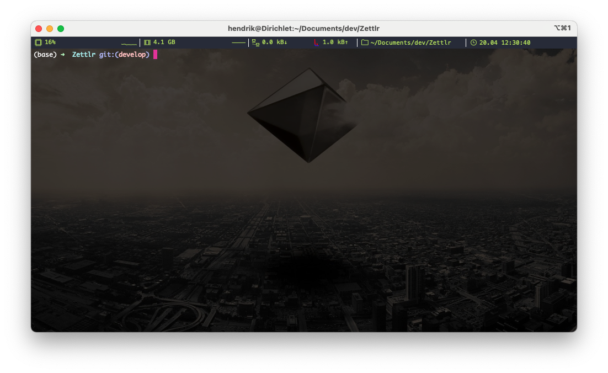

In the beginning of personal computing somewhere in the 1980s, the only way to interact with a computer was by typing in some commands using a keyboard and looking at the screen to observe some output. The whole screen was just black with some white characters popping up. You can sometimes see this today when you boot up a PC; and if you have Linux installed, you’ll be seeing even some coloured output. This text-based interaction between humans and a computer was the first to be developed, since it is arguably easy from a programming point of view to just ask the display “Hey, what resolution can you display?” and then calculate the number of lines and columns that can be displayed and place these on the screen.

However, from a UX point of view, this is obviously suboptimal, since humans are generally visual beings and it is always easier to interact with something graphical than with something text based. Thus, as graphical user interfaces (GUI) became popular in the 1990s, the terminal-based interaction moved to the back. Windows and macOS have quickly gotten rid of the terminal interface, while on Linux it’s still the default. The so-called Window server, which is responsible for displaying you something pretty to look at, runs within such a terminal interface. You can see that if you press (I think) `Ctrl+Alt+[2-5]` and switch back to the terminal where your user interface runs by pressing (again, I am not 100 % sure), `Ctrl+Alt+1`.

Even though on macOS and Windows you’ll likely never see a terminal interface by accident, terminals are still part of the operating system, and that for a reason: Terminals allow you to design some small helper scripts yourself and interact with your computer in a text-based way. There are numerous examples where the command line comes in handy, and also many where the command line might be your only chance of accomplishing something. Some examples include:

- Displaying even hidden files and folders if you don’t want them to show up in your Finder/Explorer windows (which I don’t)
- Modifying some OS preferences that are not included in the System Preferences/Settings application (`defaults set`, I am looking at you!)
- Running some scripts (which is especially useful for data scientists that use Python or R)

So, whenever there is no handy graphical app to do something for you, the chances are high that you can do it anyways on the terminal. In this blog post, I will give you a run up of what a terminal is, how it differs from Bash, and how and when you can use it effectively!

But first, as always, the TL;DR: I am using iTerm as my terminal application, but since that’s macOS only, you’ll likely need a different one for your operating system. All operating systems have at least one terminal application. **Please note that all benefits and drawbacks, thus, only apply to macOS. But since terminal applications don’t face much competition, there are no real drawbacks of the non-macOS-terminal applications!**



## TL;DR

* Application: [iTerm 2](https://iterm2.com/)
* Open Source? Yes
* Supported Platforms: macOS
* Alternatives: The built-in terminal application of your Linux distribution, if you are on Linux, or Git Bash, if you are on Windows (it’s Open Source and is included with [Git](https://www.git-scm.com), which you need to install, even if you don’t plan to use Git)
* Benefits:
    * Better customisability than the built-in terminal app
    * Has more options and generally looks nicer
* Drawbacks:
    * None, really

## The odd one out: Windows, the Command Line, and PowerShell

Before we’re diving into what a terminal is, we need (again) an extra section on why Windows is the odd one out here. In general, Windows is always the odd one out because of historical reasons. Back in the early days of computing, Bell Laboratories (today: AT&T) created an operating system called UNIX. While UNIX is seldomly seen in public nowadays, what is important is that many operating systems today are derived from UNIX. That’s why they are called “unixoid” operating systems. macOS and (I think all) Linux derivations are such unixoid operating systems. Windows, however, is not, since [Bill Gates bought the initial version of MS-DOS from some other software company](https://www.theregister.com/2011/07/27/ms_dos_turns_30), so Microsoft’s operating system never implemented anything from UNIX.

One of the most easily visible implications of that is how macOS and Linux treat files as opposed to how Windows treats files. On macOS and Linux, your computer’s hard disk starts always at `/`, which is the root directory. On Windows, it’s always `C:\`. The other implication is that since both macOS and Linux distributions are derived from UNIX, they traditionally shipped with something called Bash. We’ll get to what that is in a moment. Windows, therefore, didn’t have Bash but something else called the command line. The command line which you can still start like a normal program is what is left from Microsoft DOS, the terminal style operating system that Microsoft developed before its graphical operating system – Windows.

The big difference between using a terminal on macOS and Linux as opposed to Windows, therefore, is that the commands differ quite a bit. Additionally, the Command Line quickly turned out to be too powerless when it comes to complex tasks. So did Microsoft decide to ship Bash from there on? Obviously not! Instead, they wrote _yet another_ terminal application, called PowerShell. That one finally had similar powers when it comes to console tasks. However, it’s still confined to Windows and not available on macOS and Linux. But since basically all of the internet runs Linux, PowerShell is really only necessary when you are a system administrator who manages servers that run on Windows (called Microsoft IIS).

That is the reason why I recommend you install Git, which comes with Git bash (basically a version of the Linux terminal application that runs on Windows). Furthermore, if you want to google for help, you’ll find _much_ more information on how to fix some errors in Bash scripts than in PowerShell, so especially if you’re a beginner, I recommend you stick with Bash. As a bonus: If you write some cool script that does something fancy, this script can be run by anyone, whereas PowerShell scripts can only be run on Windows, so your macOS-friends would be left out.

But so much for why Windows is special, let’s continue with the real interesting stuff!

## Terminals and Shells: What they are and what they mean

I stated further above that a terminal is not strictly equal to a shell and that there’s a difference – now I want to explain why. The term “shell” refers to exactly that: The outer hull of an operating system, the interface between you and the innards of your computer. When you’re working with a computer, you’re never directly accessing the processor, but rather you click some buttons of a program. That program is then executing something known as a “system call.” A system call, for instance, is when you open a file. That means the program is asking the operating system “Hey, I would like to read that file!” and the operating system then checks if the program is even allowed to do so, and, if it is, then the program can read in the file’s contents. The program therefore is a _shell_ for you to interact with. The same holds true for command line interfaces. In the end there is no difference for the computer if you have to click a button in order to open a file, or if you write (as an example) `cat filename.txt` in some terminal window since in both cases there is a system call being performed.

But you’re still clueless about terminals and Bash, right? That’s understandable – it took me literally a decade to understand what the difference is. So when you open a terminal application you will have a window where you can type in commands that are then executed. How that works is that a terminal loads a _shell interpreter_ under the hood, and whatever you enter into the terminal is actually being fed into that interpreter which executes whatever you want to do. On Windows, the interpreter and the terminal window are literally the same (so the `cmd.exe ` contains its own interpreter, as does `PowerShell.exe`). On Linux and macOS, however, you have the choice. The traditional interpreter is `bash`, but another very common one is `zsh` (which is the default on macOS since Catalina).

If you’re now thinking “WHAT?!” you’re not alone. Understanding these things is a hell of an endeavour since they deviate so much from what we’re normally used to working with. To help you, let’s quickly visualise what is happening under the hood:

 application has only one specific function, whereas you can type in multiple commands in the terminal and chain several of these together to create custom functionality every time.")


I know the diagram looks confusing but it conveys a major point: A graphical user interface (GUI) application presents you some buttons for very easy access. Normally, it suffices to press a button and everything is being done automatically so that you just see the results of that process. The terminal, on the other hand, is a little bit more complex, since you have to create your “button” manually. The main difference between a graphical application and the terminal, therefore, is, that any button in a graphical application can be thought of as **a chain of several commands hard-coded into that button**. Basically, you trade ease of access for customisability, since you cannot modify what a button does — but you can customise your commands on the terminal.

A further point is that a terminal is basically just an interface between you and the bash interpreter. The bash interpreter needs text as input and outputs text, so the only purpose of the terminal application is to give you a window where you can type in that text and see whatever text the Bash interpreter outputs. As a reminder, the two greyish-blue boxes are just one for Windows’s command line and PowerShell.

Finally, there is another point I haven’t yet introduced: There is a _further_ distinction between the Bash interpreter and any commands that you can execute. If you, for example, type in `cat filename.txt` into a terminal window, this is being sent to the Bash interpreter. The bash interpreter however, will call a program called `cat` which actually opens the file `filename.txt`. **WHAT?!** Yes, it’s not getting easier, but a lot of the commands you can type into your terminal are not Bash script, but just _programs_. Even the command `ls`, which you can use to list the contents of some directory, is actually a standalone _program_. However, these programs do not have a graphical user interface, and as such they require the use of a terminal in order for you to pass text to them, and to see text that the program outputs. Let us call them _terminal applications_ to distinguish them from bash script.

Let’s wrap up: When you have a graphical application, you have _one single program_ that offers you some button which performs some action if you click it. On the other hand, when we’re talking terminal, you have the following: A _terminal application_, which offers you a graphical window where you can type commands into and see output generated by these commands. This terminal application then passes whatever you typed into it to the _bash interpreter_. The bash interpreter then looks at what you have written, and, if it’s bash script, it processes it internally, and if it’s a _terminal application_, it will run that one. In the next section, I will present examples to show you how that works in practice.

The takeaway from this section should be this:

- You cannot interact with your computer directly (neither with stuff stored on your hard disk, nor with the processor)
- So in order to do something with it, you need some interface – an application
- A _graphical application_ only provides you with a certain set of actions that allow you to _either_ create a presentation, _or_ browse the web, but normally not both
- A _terminal application_ in and of itself works just like a graphical application (sans the GUI): it offers certain functionality, but not other
- In a terminal, however, you can chain multiple of these applications together to make use of the functionality each one offers. You cannot do this with GUI applications.

## How to use the Terminal

Okay, now you can hopefully see certain use-cases for when it might make sense to use a terminal: Every time you want to do something but there’s no graphical application available. But how do you _use_ it? Let us start with some easy examples. So go into your menu and open a terminal (on macOS and Linux) or Bash (on Windows).

> Note, as I said, I will only be using Bash script here, and neither Command Line nor PowerShell scripts. These work similarly, but I don’t want to make this complicated article even more complicated. So if you’re on Windows, make sure to have a Bash window open and **not** the Command Line.

First, you should see a blank window. Let’s orient ourselves by seeing what’s inside where we currently are. Type in the command `ls`. You should see output as displayed below:

```bash
$ ls
Applications     Documents        Dropbox          Movies           Nextcloud        Public           nltk_data
Desktop          Downloads        Library          Music            Pictures         Zotero           stanza_resources
```

I am on macOS, so what you can see here are the default directories in my user folder, “Documents”, “Desktop”, “downloads” and so forth. I also use the python package “NLTK,” which requires some data which it has put in here as well. Furthermore, I also use the python package stanza (from Stanford University’s NLP Lab), which also requires some resources which it has put there.

If you’re familiar with macOS, you might’ve stumbled upon the folder “Library.” That one is normally hidden (and you can only reach it by holding down the Option key when visiting Finder’s “Go”-menu), but the `ls`-command shows it by default.

Let us now output some _more_ information on the directory contents: Let’s run the following command: `ls -l`:

```bash
$ ls -l
total 0
drwx------@  3 hendrik  staff    96 Jan 14 12:49 Applications
drwx------@  9 hendrik  staff   288 Apr 13 13:20 Desktop
drwx------+  8 hendrik  staff   256 Apr  7 17:45 Documents
drwx------@ 13 hendrik  staff   416 Apr 20 17:22 Downloads
drwx------@ 10 hendrik  staff   320 Mar 14 21:34 Dropbox
drwx------@ 84 hendrik  staff  2688 Apr 20 12:15 Library
drwx------   7 hendrik  staff   224 Mar 18 17:16 Movies
drwx------+  4 hendrik  staff   128 Feb  6 11:02 Music
drwx------  33 hendrik  staff  1056 Apr 20 18:27 Nextcloud
drwx------+  9 hendrik  staff   288 Feb  6 18:49 Pictures
drwxr-xr-x+  4 hendrik  staff   128 Jan 14 12:20 Public
drwxr-xr-x  18 hendrik  staff   576 Apr 20 13:03 Zotero
drwxr-xr-x   4 hendrik  staff   128 Mar 29 16:35 nltk_data
drwxr-xr-x   4 hendrik  staff   128 Feb 24 17:18 stanza_resources
```

Wow! That’s much more output! You can now see some properties of the directories, and all of them are now listed vertically in a table-like layout. What you can see here is (from left to right) the _permissions_ and _flags_, the _owner account_, the _owner group_, the size (in bytes), and the _last modification date_. Since this is an article on how to use a terminal, I won’t go over the specifics of this information. Important is only that the `-l` you passed to the command was an _argument_, more specifically a _switch_. A switch is just some letter, and if it’s present (and it must be prefixed with a hyphen), then the program will behave differently. In common language, we have basically told the “list” command to layout its output as a **l**ist (hence the l). Let us now pass another switch for **a**ll:

```bash
$ ls -al
total 472
drwxr-xr-x+ 53 hendrik  staff    1696 Apr 20 18:41 .
drwxr-xr-x   6 root     admin     192 Jan  1  2020 ..
-r--------   1 hendrik  staff       7 Jan 14 12:20 .CFUserTextEncoding
-rw-r--r--@  1 hendrik  staff   10244 Apr 18 00:52 .DS_Store
-rw-r--r--   1 hendrik  staff       0 Mar 19 15:30 .Rapp.history
-rw-r--r--   1 hendrik  staff       0 Mar 19 15:31 .Rhistory
drwx------   5 hendrik  staff     160 Apr 20 10:23 .Trash
drwxr-xr-x   3 hendrik  staff      96 Jan 21 15:20 .anaconda
-rw-r--r--   1 root     staff     447 Jan 21 15:20 .bash_profile
drwxr-xr-x   3 hendrik  staff      96 Mar 19 09:39 .cache
drwxr-xr-x   6 hendrik  staff     192 Apr 13 13:58 .composer
drwxr-xr-x   3 hendrik  staff      96 Jan 22 10:57 .conda
-rw-r--r--   1 hendrik  staff      40 Jan 22 08:18 .condarc
drwx------   7 hendrik  staff     224 Mar 20 18:49 .config
drwxr-xr-x  14 hendrik  staff     448 Jan 14 17:46 .dropbox
-rw-r--r--   1 hendrik  staff      73 Feb  5 14:28 .gitconfig
drwxr-xr-x   5 hendrik  staff     160 Jan 14 17:26 .ipython
drwxr-xr-x   5 hendrik  staff     160 Feb 13 14:42 .jupyter
drwx------   3 hendrik  staff      96 Mar  6 18:57 .local
drwxr-xr-x   3 hendrik  staff      96 Jan 21 16:42 .matplotlib
drwxr-xr-x   3 hendrik  staff      96 Apr  3 21:22 .mono
drwxr-xr-x   3 hendrik  staff      96 Mar 20 18:54 .node-gyp
drwxr-xr-x   6 hendrik  staff     192 Mar 20 18:58 .npm
drwxr-xr-x  21 hendrik  staff     672 Apr 16 10:42 .oh-my-zsh
drwxr-xr-x   5 hendrik  staff     160 Mar 29 09:20 .pylint.d
-rw-------   1 hendrik  staff     674 Apr 15 11:42 .python_history
drwxr-xr-x   2 hendrik  staff      64 Mar 19 15:25 .r
-rw-r--r--   1 hendrik  staff    3171 Feb  9 21:02 .searchlink
drwx------   3 hendrik  staff      96 Jan 16 11:23 .ssh
drwxr-xr-x   5 hendrik  staff     160 Mar 24 20:40 .texmf
-rw-------   1 hendrik  staff    6829 Feb 22 08:58 .viminfo
drwxr-xr-x   5 hendrik  staff     160 Mar 15 17:34 .vscode
drwxr-xr-x   4 hendrik  staff     128 Mar 19 22:48 .vscode-insiders
-rw-r--r--   1 hendrik  staff     261 Mar 24 20:43 .wget-hsts
-rw-r--r--   1 hendrik  staff     163 Apr 11 10:35 .yarnrc
-rw-r--r--   1 hendrik  staff   48130 Apr 16 10:42 .zcompdump-Dirichlet-5.8
-rw-------   1 hendrik  staff  131060 Apr 20 18:41 .zsh_history
drwx------   4 hendrik  staff     128 Mar  5 18:49 .zsh_sessions
-rw-r--r--   1 hendrik  staff    4472 Jan 22 11:03 .zshrc
drwx------@  3 hendrik  staff      96 Jan 14 12:49 Applications
drwx------@  9 hendrik  staff     288 Apr 13 13:20 Desktop
drwx------+  8 hendrik  staff     256 Apr  7 17:45 Documents
drwx------@ 13 hendrik  staff     416 Apr 20 17:22 Downloads
drwx------@ 10 hendrik  staff     320 Mar 14 21:34 Dropbox
drwx------@ 84 hendrik  staff    2688 Apr 20 12:15 Library
drwx------   7 hendrik  staff     224 Mar 18 17:16 Movies
drwx------+  4 hendrik  staff     128 Feb  6 11:02 Music
drwx------  33 hendrik  staff    1056 Apr 20 18:27 Nextcloud
drwx------+  9 hendrik  staff     288 Feb  6 18:49 Pictures
drwxr-xr-x+  4 hendrik  staff     128 Jan 14 12:20 Public
drwxr-xr-x  18 hendrik  staff     576 Apr 20 13:03 Zotero
drwxr-xr-x   4 hendrik  staff     128 Mar 29 16:35 nltk_data
drwxr-xr-x   4 hendrik  staff     128 Feb 24 17:18 stanza_resources
```

What just happened?! By telling the command to output _all_ files and folders, it has now additionally included so-called **dotfiles** (rather, in this case, dot-_directories_). On macOS and Linux, those directories prefixed with a dot are by convention used to store some user-specific configuration. As you can see, I have also had R installed at some point, indicated by the folder `.r`, which contains its configuration. Sidenote: The `.Trash`-directory is actually your recycle bin. So if you’re moving anything into the trash bin (that behaviour is the same for all operating systems), that not means to “delete” something, it’s just moving it to a specific folder which is hidden from view. That is just one of the many examples for how a graphical operating system tries to give us _analogies_, even if they’re not technically correct.

If you would’ve just passed the `a`-option to the command, but not `l`, then it would’ve displayed _all_ files, but not as a list, but as the “grid” you can see in the first example.

Just using the terminal to browse your files might seem a little bit odd, given that the Finder and Explorer are actually quite decent for that task. A better example would be to run Pandoc from the terminal: Instead of typing `ls`, which opens that terminal application, you can type `pandoc` (if it is installed, that is!) and execute it. If it’s not installed, your Terminal will tell you the following (note the “zsh” which indicates I’m not using Bash but ZSH – but forget about that right now):

```bash
$ pandoc
zsh: command not found: pandoc
```

But if it is, and you would, for example, like to know which _version_ is installed, the output would look like this:

```bash
$ pandoc --version
pandoc 2.13
Compiled with pandoc-types 1.22, texmath 0.12.2, skylighting 0.10.5,
citeproc 0.3.0.9, ipynb 0.1.0.1
User data directory: /Users/hendrik/.local/share/pandoc
Copyright (C) 2006-2021 John MacFarlane. Web:  https://pandoc.org
This is free software; see the source for copying conditions. There is no
warranty, not even for merchantability or fitness for a particular purpose.
```

As you can see, I have Pandoc 2.13 installed. Then I can follow the instructions on their website to use Pandoc to convert documents from one format into the other. Pretty nice!

## A Practical Example

But now let’s imagine one task which is pretty hard to do with the Finder or Windows explorer, but ridiculously easy with a terminal: Let us assume you have some big directory in which you have amassed hundreds of photos, dozens of PDF documents, the occasional word document and a few random files, all unsorted, completely messy and there’s no way you’re ever going to find anything again. Yes, I am in fact talking about your desktop.

Now imagine you wanted to sort it by file type, that is: Put all images in one folder, all PDF files in another one, and collect the word documents in a third one. With your file browser, that would involve a lot of clicking, and if you don’t hold `Ctrl` or `Cmd` down _once_, you can begin anew in selecting all files. Let’s make this easier! For this example, I will show you all commands at once and add an explanation above them to keep it short:

```bash
# First, we have to go to the Desktop, which is done using "cd",
# or "change directory"
cd Desktop
# Now let us create a directory for the images (mkdir = make
# directory)
mkdir images
# Let's do the same for PDF files and word documents. You can
# pass multiple directory names at once
mkdir docs pdf
# Now we need to copy over the correct files (cp = copy; if
# you want to move them there, use mv instead). The *-characters
# tell the command "look into all directories, and copy all files
# irrespective of their file name; they only need to be JPEG-files."
cp **/*.jpg ./images
# The same command, with the correct file extension for the rest:
cp **/*.docx ./docs
cp **/*.pdf ./pdf
```

And now you have all files sorted by file type into their own directories! But you still have them on your desktop if you didn’t use the `mv` command. So … how do you **r**e**m**ove them? You guessed it:

```bash
rm **/*.jpg # And corresponding for all other file types
```

The whole `**/*`-part, by the way, is called “[globbing](https://linuxhint.com/bash_globbing_tutorial/),” which is pretty powerful.

## Automation with Bash Script

Now you have cleaned up your desktop, but of course, after a few weeks it’s time again: The desktop is cluttered with files again. So time to run it again! Or, should you …? Of course, programmers are lazy, and if they have to do a thing _once_, they know they will have to do it _again_, so they will automate it. Enter Bash script.

Before, I already said that there’s a difference between terminal _applications_ that will be run, and bash script, which is interpreted by the bash interpreter. If something looks like a terminal application, Bash will simply run it, whereas if something looks like a script, it will interpret it and act accordingly. The easiest start to a bash script is to create a new file that has the file ending `.sh` and simply copy and paste the commands in there, one command per line. However, out of security reasons you first have to tell Bash “Yes, it’s fine to run this file” by making it executable. That works by setting the `x`-flag on the file:

```bash
$ chmod +x your-file.sh
```

(By the way, that’s about all I know about permissions and stuff. Other common forms are `644` and `755`, but that’s about it.)

Now you can basically execute all commands at once by just running the file:

```bash
$ /path/to/your-file.sh
```

Finally, if we return back to our “button” example from above: The _real_ power of Bash and the terminal comes to fruition if you actually chain the functions of several commands together. Let me just give the contents of an example `.sh`-file here to demonstrate a few capabilities:

```bash
#!/usr/bin/bash

# The line above, by the way, is called a "shebang" and that indicates what language
# this file is. You could, for example, also add #!/usr/bin/python as the first
# line to declare that the file contains Python code. I never tried that but it
# should work!

# The line below tells Bash "Please run the command ls -al" and write the output
# of that command into the variable DIR_CONTENTS.
DIR_CONTENTS=$(ls -al)

# Do you want to see the output of that ls -al command? Then add this line:
echo $DIR_CONTENTS

# The following line takes the variable DIR_CONTENTS, and passes it to another
# command (this is done using the vertical bar). The command "grep"
# can be used to filter text: It will, in this example, output all lines
# that contain the characters ".docx". However, since the whole thing is
# surrounded by $(), that means that the output of grep will be written into
# the variable WORD_DOCUMENTS
WORD_DOCUMENTS=$(echo $DIR_CONTENTS | grep .docx)

# The following looks at the variable WORD_DOCUMENTS. If it is empty (-z)
# this indicates that there were no Word documents in the folder. This script
# will display the corresponding message to you.
if [ -z "$WORD_DOCUMENTS" ]
then
    echo "There were no word documents in the folder!"
else
    echo "There were word documents in the folder."
fi
```

As you can see, Bash script is very powerful, and it enables you to automate quite some tasks. Especially if they are repetitive there is a good chance that they can be automated using Bash. If you want to look at some more “real world” examples that I coded, here are a few with a lot of comments:

* [This script runs a few macOS-only commands in order](https://github.com/Zettlr/Zettlr/blob/b992574620aeca32f295dc4b899c5cecc32d64d6/scripts/add-osx-cert.sh); it is very similar in structure to the file-sorting example above
* [This script uses more sophisticated logic](https://github.com/Zettlr/Zettlr/blob/b992574620aeca32f295dc4b899c5cecc32d64d6/scripts/get-pandoc.sh), but since it’s the first really complex one I wrote, I explained almost everything in great detail

## Conclusion

In this article I wanted to introduce you to yet another tool that I use every day. Unlike the other applications I have thus far demonstrated in this series, _really_ understanding how to use a terminal productively is much more difficult. However, as I could hopefully demonstrate, it is certainly worthwhile to spend some time digging into the intricacies of bash script. Bash script may be more complicated than any graphical application, but it is much more powerful, and even the examples I gave here are extremely limited. You can do much more fancy stuff such as daemonising processes (yes, you’re computer is possessed!), redirecting output flows across multiple streams, and what not else.

It is very likely that you’re not going to use the terminal _extensively_, but losing your fear of it because it looks “technical” certainly helps. As a bonus, let me share two last things with you. First, you can not only run terminal applications from the terminal, but also GUI applications! If you’re on macOS, just try running the following to start up Zettlr (or replace Zettlr with any other app):

```bash
$ /Applications/Zettlr.app/Contents/MacOS/Zettlr
```

On Windows, it looks quite similar:

```bash
$ C:\Path\to\Zettlr.exe
```

If you now quit the terminal, however, that will _also_ quit the app because the app has not been started from the operating system but rather from the terminal.

Finally, the second thing I wanted to share for the macOS users out there: You can use the terminal productively by installing [Homebrew](https://brew.sh). It offers quite a lot of different apps and tools that you can then additionally use in your bash scripts. The sky is the limit!

I hope that you know have a basic understanding of the terminal and why it’s practical in everyday business – not just for programming as I need it mostly for, but for many other things as well!
